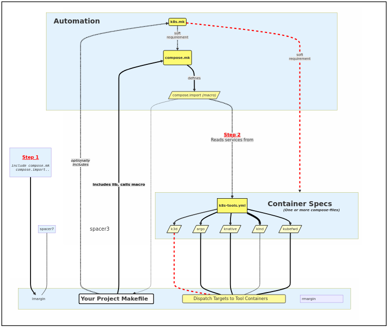

<table style="width:100%">
  <tr>
    <td colspan=2><strong>
    k8s-tools
      </strong>&nbsp;&nbsp;&nbsp;&nbsp;
    </td>
  </tr>
  <tr>
    <td width=15%></td>
    <td>
      Completely dockerized version of a kubernetes toolchain, <br/>
      plus a minimal automation framework for interacting with that toolchain.
      <br/><br/>
      <a href="https://github.com/elo-enterprises/k8s-tools/actions/workflows/docker-test.yml"></a>
    </td>
  </tr>
</table>

-------------------------------------------------------------

<div class="toc">
<ul>
<li><a href="#overview">Overview</a></li>
<li><a href="#features">Features</a></li>
<li><a href="#quick-start">Quick Start</a><ul>
<li><a href="#clonebuildtest-this-repo">Clone/Build/Test This Repo</a></li>
<li><a href="#tools-via-compose-cli">Tools via Compose CLI</a></li>
<li><a href="#tools-via-make">Tools via Make</a></li>
</ul>
</li>
<li><a href="#integration-with-your-project">Integration With Your Project</a><ul>
<li><a href="#embedding-tools-with-aliases">Embedding Tools With Aliases</a></li>
<li><a href="#embedding-tools-with-makefiles">Embedding Tools With Makefiles</a></li>
</ul>
</li>
<li><a href="#composemk">compose.mk</a><ul>
<li><a href="#but-why">But Why?</a></li>
<li><a href="#makecompose-bridge">Make/Compose Bridge</a></li>
<li><a href="#composemk-api-dynamic">compose.mk API (Dynamic)</a></li>
</ul>
</li>
<li><a href="#this-pipeline-is-serial-but-the-iotee-targets-providers-some-sugar-for-working-with-pipes-in-parallel">This pipeline is serial, but the io.tee targets providers some sugar for working with pipes in parallel.</a><ul>
<li><a href="#makecompose-bridge-with-k8s-toolsyml">Make/Compose Bridge with k8s-tools.yml</a></li>
<li><a href="#container-dispatch">Container Dispatch</a></li>
<li><a href="#macro-arguments">Macro Arguments</a></li>
<li><a href="#container-dispatch-syntaxsemantics">Container Dispatch Syntax/Semantics</a></li>
<li><a href="#multiple-compose-files">Multiple Compose Files</a></li>
<li><a href="#example-platform-setup">Example: Platform Setup</a></li>
<li><a href="#api-composemk">API: compose.mk</a></li>
</ul>
</li>
<li><a href="#k8smk">k8s.mk</a><ul>
<li><a href="#but-why_1">But Why?</a></li>
<li><a href="#k8smk-api">k8s.mk API</a></li>
</ul>
</li>
<li><a href="#demo-cluster-automation">Demo: Cluster Automation</a><ul>
<li><a href="#boilerplate-overrides-clean-init">Boilerplate, Overrides, Clean &amp; Init</a></li>
<li><a href="#provisioning">Provisioning</a></li>
<li><a href="#testing">Testing</a></li>
<li><a href="#debugging">Debugging</a></li>
<li><a href="#development">Development</a></li>
<li><a href="#alternate-deployment">Alternate Deployment</a></li>
<li><a href="#next-steps">Next Steps</a></li>
<li><a href="#conclusion">Conclusion</a></li>
</ul>
</li>
<li><a href="#known-limitations-and-issues">Known Limitations and Issues</a><ul>
<li><a href="#kubeconfig-should-already-be-set">KUBECONFIG should already be set</a></li>
<li><a href="#working-directories">Working Directories</a></li>
<li><a href="#general-argument-passing">General Argument Passing</a></li>
<li><a href="#docker-and-file-permissions">Docker and File Permissions</a></li>
<li><a href="#macos-docker-sockets-and-dind">MacOS, Docker Sockets, and DinD</a></li>
<li><a href="#pipes-temp-files">Pipes &amp; Temp Files</a></li>
<li><a href="#motivation-design-philosophy">Motivation &amp; Design Philosophy</a><ul>
<li><a href="#why-composemk">Why compose.mk?</a></li>
<li><a href="#why-k8smk">Why k8s.mk?</a></li>
</ul>
</li>
</ul>
</li>
</ul>
</div>


-------------------------------------------------------------

## Overview

This repository aggregates 20+ individual utilities for working with kubernetes into one dockerized toolchain, hosted inside a single compose file as [k8s-tools.yml](k8s-tools.yml).  It's useful for CI/CD pipelines but can also be [embedded alongside your existing project](#integration-with-your-project), which helps to fix the problem of different project developers using different local versions of things like `helm`, `kubectl`, etc.

* The containers defined here aren't built from scratch, and official sources are used where possible.  Most tools (like `kubectl`, `helm`, etc) come from [alpine/k8s](https://hub.docker.com/r/alpine/k8s) but many other tools are also included (like `k9s`, `k3d`).  This isn't an attempt to build an omnibus "do-everything" container.. it's more a response to the fact that there are a lot of diverse tools that really can't be unified, so it's better to just learn how to work with that.

Besides bundling some tooling, this repository is the reference implementation of a pattern for [bridging compose services and Makefile targets](#composemk), **providing a minimum viable automation framework for orchestrating tasks across tool containers that is expressive and flexible, while also focusing on minimizing both conceptual overhead and software dependencies.**  This pattern is incredibly useful for lots of things, but this reference focuses on a few use-cases in particular:

1. Decoupling project automation from the choice of CI/CD backend
1. Proper separation of automation tasks from specifications for runtime / container context.
1. Per-project tool-versioning, providing defaults but allowing overrides, and generally ensuring versions match everywhere.
1. Project-local kubernetes clusters & corresponding lifecycle automation using kind or k3d.
1. Cluster lifecycle / development / debugging workflows in general.
1. Less shell code in general, but where we need it: it should be reasonably structured, and it <u>shouldn't</u> be embedded in YAML.

There's a lot of hate for `make` (especially for "creative" usage of it!), but you'll find that these are not the Makefile's of your ancestors.

**Working with [compose.mk](#composemk) and [k8s.mk](#k8smk) makes `make` hit different.**  Besides addressing the issues above, it adds new capabilities to `make` itself.  Container-dispatch feels like a tiny, unobtrusive DSL layer on top of tech you already know, and you can run it anywhere you are, and spend less time negotiating with bolted-on plugin-frameworks, hook systems, and build-bots.  (And the build-bots themselves will be happy to run it too.)  On the one hand, lots of `compose.mk` functionality is just syntactic sugar for string-rewriting.  On the other hand.. the result actually feels like a new paradigm, tends to encourage better design for your automation, and makes working with `make` feel more like a programming language.

This diagram shows the way that the elements of the compose.mk / k8s.mk / k8s-tools.yml trifecta are related to each other:

<center></center>

-------------------------------------------------------------


## Features

[k8s-tools.yml](#) | [compose.mk](#) | [k8s.mk](#)

**[k8s-tools.yml](k8s-tools.yml)** is a compose file with 20+ container specifications covering popular platforming tools and other utilities for working with Kubernetes.  This file makes use of the [dockerfile_inline directive](https://docs.docker.com/compose/compose-file/build/#dockerfile_inline), plus the fact that tool-containers  *tend to involve layering really small customizations*.  Now you can version these tools explicitly, customize them if you need to, and still to avoid having N Dockerfiles cluttering up your whole repository.  

Here's a quick overview of the manifest:

* **Local parts of the tool bundle** ([See the latest here](k8s-tools.yml))
  * **Cluster management:** [kind](https://github.com/kubernetes-sigs/kind), [k3d](https://k3d.io/)
  * **Workflows, FaaS, and Misc Platforming Tools:** [argocli](https://argo-workflows.readthedocs.io/en/latest/walk-through/argo-cli/), [kn](https://knative.dev/docs/client/install-kn/), [fission](https://fission.io/docs/installation/), [rancher](https://github.com/rancher/cli)
  * **Lower level helpers:** [helmify](https://github.com/arttor/helmify), [kompose](https://kompose.io/), [kubefwd](https://github.com/txn2/kubefwd)
  * **Monitoring and metrics tools:** [promtool](https://prometheus.io/docs/prometheus/latest/command-line/promtool/), [k9s](https://k9scli.io/), [lazydocker](https://github.com/jesseduffield/lazydocker)
  * **Krew plugins:** [sick-pods](https://github.com/alecjacobs5401/kubectl-sick-pods), [ktop](https://github.com/vladimirvivien/ktop), [kubectx, and kubens](https://github.com/ahmetb/kubectx) available by default, and more on demand.
  * **TUI and user-messaging utilities**: [gum](https://github.com/charmbracelet/gum), [pv](https://www.ivarch.com/programs/pv.shtml), [spark](https://raw.githubusercontent.com/holman/spark/)
  * **General Utilities:** Fixed (i.e. non-busybox) versions of things like date, ps, uuidgen, etc
* **Upstream parts of the tool bundle** ([See the latest here](https://github.com/alpine-docker/k8s/blob/master/README.md#installed-tools) for more details on that.)
  * **Cluster management:** [eksctl](https://github.com/weaveworks/eksctl)
  * **Core Utilities:** [kubectl](https://kubernetes.io/docs/tasks/tools/install-kubectl/), [kustomize](https://github.com/kubernetes-sigs/kustomize), [helm](https://github.com/helm/helm), [krew](https://github.com/kubernetes-sigs/krew)
  * **Misc Utilities:** [helm-diff](https://github.com/databus23/helm-diff), [helm-unittest](https://github.com/helm-unittest/helm-unittest), [helm-push](https://github.com/chartmuseum/helm-push), [kubeseal](https://github.com/bitnami-labs/sealed-secrets), [vals](https://github.com/helmfile/vals), [kubeconform](https://github.com/yannh/kubeconform)
  * **Cloud Utilities:** [awscli v1](https://github.com/aws/aws-cli), [aws-iam-authenticator](https://github.com/kubernetes-sigs/aws-iam-authenticator)
  * **General Utilities:** Such as bash, curl, jq, yq, etc

**Versioning for Tools:**

* *Tooling in the local bundle is all versioned independently:*
  * Defaults are provided, but overrides allowed from environment variables.
* *Upstream tool versioning is determined by the alpine-k8s base,*
  * But *k8s-tools.yml* has service-stubs and layout that can be easily changed if you need something specific.

**Other Features:**

* *Just-in-Time & On-Demand:*
  * As usual with docker-compose, containers aren't pulled until they are used, and build-when-changed mostly works as you'd expect.
  * *Having these declared in case of eventual use won't saddle you with an enormous bootstrap process!*
* *Sane default volumes for tool-containers,* including:
  * Sharing the working directory, docker socket, and kubeconfigs for you automatically.  
* *Fixes docker file-permissions for root-user containers* (probably).  
  * Seems to work pretty well in Linux and Mac ([more details](#docker-and-file-permissions)).
* 🚀 *Executable file:*  
  * `./k8s-tools.yml ...  <==> docker compose -f k8s-tools.yml ...`

The focus for k8s-tools.yml is to stand alone with no host dependencies, not even Dockerfiles, yet provide boilerplate that's parametric enough to work pretty well across different projects, without changing the compose file.  If the default tool versions don't work for your use-cases, [k8s-tools.yml probably has an environment variable you can override](#environment-variables).

------

After you've made your whole tool chain portable in one swipe, you might also be interested in *driving* those tools with something that offers more structure than a shell script, and something that also *won't add to your dependencies*.  If that sounds interesting, you might like to meet `compose.mk` and `k8s.mk`.

<ins>**[compose.mk](#composemk)**, a Makefile automation library / CLI tool, defining targets and macros for working with compose files & services.</ins>

**Importing Compose Services:**

The main focus for `compose.mk` is providing the `compose.import` macro:

  * **Tool containers can be 'imported' as a group of related make-targets.**
    * Interact with them using the [Make/compose bridge](#makecompose-bridge)
    * [Use container-dispatch syntax](#container-dispatch) to run existing make-targets **inside** tool containers
    * Use the containers effectively from "outside", or drop into debugging shell "inside"
  * **Tool containers can be anything, defined anywhere:**
      * No explicit dependency for k8s-tools.yml
      * [Multiple compose-files are supported](#) 

**Other Features:** 

  * **[Curated collection of reusable utility targets](#composemk-api)**, which are arranged into a few namespaces:
    * **`flux.*` targets:** A tiny but powerful workflow/pipelining API, roughly comparable to something like [declarative pipelines in Jenkins](https://www.jenkins.io/doc/book/pipeline/syntax/).  This provides concurrency/staging operators that compose over make-target names.
    * **`stream.*`:** Primitives for working with streams, including support for newline/comma/space delimited streams, common use cases with JSON, etc.  Everything here is used with pipes, and reads from stdin.  It's not what you'd call "typed", but it reduces error-prone parsing and moves a little bit closer to structured data.
    * **`docker.*`:** A small interface for working with docker.  
    * **`io.*`:** Misc. utilities for printing, formatting, timers, etc.
  * 🚀 *Executable file:*
    * `./compose.mk ...  <==> make -f compose.mk ...`

---

<ins>**[k8s.mk](#k8smk)**, a Makefile automation library/CLI tool, defining various targets for working with Kubernetes.</ins>

  * Useful as a library, especially if you're building cluster lifecycle automation
  * Useful as an interactive debugging/inspection/development tool.
  * Do the common tasks quickly, interactively or from other automation
    * Launch a pod in a namespace, or a shell in a pod, without lots of kubectling
    * Stream and pipe commands to/from pods, or between pods

****

**Other Features:** 

  * **[Curated collection of automation interfaces](#k8smk-api)**, arranged into a few namespaces:
    * **`k8s.*`:** Default namespace with debugging tools, cluster life-cycle primitives, etc.
    * **`tui.*`:** Control-surface for a tmux-backed console geometry manager.
      * **No host dependencies.** This uses the `k8s:dux` tool container to dockerize tmux.
      * Uses docker-in-docker to interact with your other containers seamlessly.
      * Open split-screen displays, shelling into 1 or more of the tool containers in k8s-tools.yml.
      * Combine with `flux.*` target and quickly create dashboards / custom development environments.
    * Plus more specific interfaces to k3d, kubefwd, etc. [Full API here.](#k8smk-api)
  * 🚀 *Executable file:*
    * `./k8s.mk ...  <==> make -f k8s.mk ...`

Both `compose.mk` and `k8s-tools.yml` files are a soft-dependency for `k8s.mk`, because the emphasis is on seamless usage of those containers.  But you can still use many targets "natively" if your host already has the relevant tools.  It also provides some primitives for common tasks (like waiting for all pods to be ready), context management (like setting the active namespace), the usual patterns (like idempotent usage of `helm`), and the automate the TUI itself (like sending specific targets to specific panes).

-------------------------------------------------------------

## Quick Start

### Clone/Build/Test This Repo

```bash
# for ssh
$ git clone git@github.com:elo-enterprises/k8s-tools.git

# or for http
$ git clone https://github.com/elo-enterprises/k8s-tools

# build the tool containers & check them
$ make clean build test
```

----------------------------------------------------

### Tools via Compose CLI

```bash
$ docker compose run -f k8s-tools.yml argo ...
$ docker compose run -f k8s-tools.yml awscli ...
$ docker compose run -f k8s-tools.yml aws-iam-authenticator ...
$ docker compose run -f k8s-tools.yml dind ...
$ docker compose run -f k8s-tools.yml eksctl ...
$ docker compose run -f k8s-tools.yml fission ...
$ docker compose run -f k8s-tools.yml graph-easy ...
$ docker compose run -f k8s-tools.yml gum ...
$ docker compose run -f k8s-tools.yml helm ...
$ docker compose run -f k8s-tools.yml helm-diff ...
$ docker compose run -f k8s-tools.yml helmify ...
$ docker compose run -f k8s-tools.yml helm-push ...
$ docker compose run -f k8s-tools.yml helm-unittest ...
$ docker compose run -f k8s-tools.yml jq ...
$ docker compose run -f k8s-tools.yml k3d ...
$ docker compose run -f k8s-tools.yml k8s ...
$ docker compose run -f k8s-tools.yml k9s ...
$ docker compose run -f k8s-tools.yml kind ...
$ docker compose run -f k8s-tools.yml kn ...
$ docker compose run -f k8s-tools.yml kompose ...
$ docker compose run -f k8s-tools.yml krew ...
$ docker compose run -f k8s-tools.yml krux ...
$ docker compose run -f k8s-tools.yml kubeconform ...
$ docker compose run -f k8s-tools.yml kubectl ...
$ docker compose run -f k8s-tools.yml kubefwd ...
$ docker compose run -f k8s-tools.yml kubeseal ...
$ docker compose run -f k8s-tools.yml kustomize ...
$ docker compose run -f k8s-tools.yml lazydocker ...
$ docker compose run -f k8s-tools.yml promtool ...
$ docker compose run -f k8s-tools.yml rancher ...
$ docker compose run -f k8s-tools.yml vals ...
$ docker compose run -f k8s-tools.yml yq ...
```

----------------------------------------------------

### Tools via Make 

Commands like this will work at the repository root to interact with the tool containers in k8s-tools.yml:

```bash
# run kubectl, which can be used directly or with pipes 
$ cmd='apply -f my-manifest.yml' make kubectl
$ cat my-manifest.yml | make kubectl/pipe cmd='apply -f -'

# run helmify (which expects stdin)
$ cat my-manifest.yml | make helmify/pipe

# drop to a shell to work with helm container (interactive; plus '.' is already volume-shared)
$ make helm/shell

# get cluster info from k3d
$ make k3d cmd='cluster list -o json'

# equivalently 
$ echo k3d cluster list -o json | make k3d/shell/pipe
```

For more details about targets that are **autogenerated for tool containers in the compose-spec**, how this works in general, and what else you can do with it.. check out the docs for [the Make/Compose bridge](#makecompose-bridge).  There are various static-targets available too, [see the API docs for compose.mk](#static-targets-for-composemk).

Building on the capabilities of those tool-containers, here's some random examples of using k8s.mk.  

```bash
# KUBECONFIG should already be set!
# wait for all pods in all namespaces
$ make k8s.wait

# start a debugging shell in the 'default' namespace and attach to it (interactive)
$ make k8s.test_harness/default/my-test-harness 
$ make k8s.shell/default/my-test-harness

# run k9s TUI for the given namespace (intreractive)
$ make k9s/my-namespace
```

For the full documentation of those targets, see [k8s.mk API](#static-targets-for-k8smk).

This repository includes lots of examples for make/compose integration in general, and in particular how you can accomplish lifecycle scripting with k8s.mk.

* For advanced usage that builds automation APIs by running targets *inside* tool containers, see [the dispatch-demo](#container-dispatch).
* For a more involved tutorial [see the cluster-lifecycle demo](#demo-cluster-automation).
* For examples, you can also the [integration tests](tests/Makefile.itest.mk) and [end-to-end tests](tests/Makefile.e2e.mk).  
* For a complete, external project that uses this approach for cluster automation, see [k3d-faas.git](https://github.com/elo-enterprises/k3d-faas)

----------------------------------------------------

## Integration With Your Project

You can embed the k8s-tools suite in your project in two ways, either with some kind of global compose file and global aliases, or with a more project-based approach using Makefiles.

----------------------------------------------------

### Embedding Tools With Aliases

To use this pattern with your existing projects, you might want to maintain separated compose files and setup aliases.

```bash
$ cd myproject

# or use your fork/clone..
$ curl -sL https://raw.githubusercontent.com/elo-enterprises/k8s-tools/master/k8s-tools.yml > k8s-tools.yml

$ alias helm=docker compose -f myproject/k8s-tools.yml run helm

$ helm ....
```

Aliases are convenient but rather fragile (obviously this will break if you move your `myproject` folder around).  See the next section for something that is a more durable and flexible.

----------------------------------------------------

### Embedding Tools With Makefiles

You'll probably want to read over the [compose.mk](#composemk) section to understand what's going on here.  In case you've already seen it though, here's the quick start with the copy/paste stuff.


First, copy the files from this repo into your project:

```bash
$ cd myproject 

# Download the compose file with the tool containers
$ curl -sL \
  https://raw.githubusercontent.com/elo-enterprises/k8s-tools/master/k8s-tools.yml \
    > k8s-tools.yml

# Download the compose.mk automation lib
$ curl -sL \
  https://raw.githubusercontent.com/elo-enterprises/k8s-tools/master/compose.mk \
    > compose.mk

# Optional.  
# Download the k8s.mk automation lib.
$ curl -sL \
  https://raw.githubusercontent.com/elo-enterprises/k8s-tools/master/k8s.mk \
    > k8s.mk
```

These 3 files are usually working together, but in some cases they are useful in a stand-alone mode.  Make them all executable if you want to use that:

```bash
$ chmod ugo+x k8s-tools.yml compose.mk k8s.mk

# equivalent to `make -f k8s.mk ..`
./k8s.mk ... # ===> 

# equivalent to `make -f compose.mk ..`
$ ./compose.mk ... ===> 

# equivalent to `docker compose -f k8s-tools.yml run ...`
$ ./k8s-tools.yml run ...
```

If you're interested in setting up the [Make/Compose bridge](#makecompose-bridge) or preparing for [Container Dispatch](#container-dispatch), here's and example of what your Makefile should look like:

```Makefile
# myproject/Makefile (Make sure you have real tabs, not spaces!)
 
# Include/invoke the target-building macros 
# somewhere near the top of your existing boilerplate
include compose.mk
$(eval $(call compose.import, ▰, TRUE, k8s-tools.yml))

# At this point, targets are defined for whatever services
# are mentioned in the external compose config, and they are
# ready to use. Now you can dispatch any task to any container!
test: ▰/k8s/self.test
self.test:
  kubectl --version
  echo hello world from `uname -n -v`
```


---------------------------------------------------------------

## compose.mk

A tool / library / automation framework for working with containers.

  * Library-mode extends `make`, adding native support for working with (external) container definitions
  * Stand-alone mode also available, i.e. a tool that requires no external Makefile / compose file.
  * A minimal, elegant, and dependency-free approach to describing workflow pipelines. (See the [flux.* API](#))
  * A small-but-powerful built-in TUI framework with no host dependencies. (See the [crux.* API](#)) 

**Zero host dependencies,** as long as you have docker + make.  Even the TUI backend is dockerized.

**In library Mode,** `compose.mk` is used as an `include` from your project Makefile.  With that as a starting place, you can **[build a bridge between docker-compose services and make-targets](#makecompose-bridge)** and use [**minimum viable patterns for container-dispatch.**](#container-dispatch).  The main macro is called *`compose.import`*, which can be used/included from any Makefile, used with any compose file, and [used with *multiple* compose files](#multiple-compose-files).  

**In tool mode,** you won't need an external Makefile or a docker-compose file, and you can still use many aspects of the embedded TUI, workflow library, etc.

If you prefer to learn from examples, you might want to just [get started](#makecompose-bridge) or skip to the main [cluster automation demo](#demo-cluster-automation) or to a [tui demo](#demo-tui).  If you're the type that needs to hear the motivation first, read on in the next section.

----------------------------------------------------

### But Why?

There's many reasons why you might want these capabilities if you're working with tool-containers, builds, deploys, and complex task orchestration.  People tend to have strong opions about this topic, and it's kind of a long story.  

The short version is this: Makefiles run practically everywhere and most people can read/write them.  They're also really good at describing DAGs, and lots of automation, but *especially life-cycle automation*, is a natural fit for this paradigm.  The only trouble is that a) *make has nothing like native support for tasks in containers*, and b) *describing the containers themselves is even further outside of it's domain*.  Meanwhile, docker-compose is exactly the opposite.Make/Compose are already a strong combination for this reason, and by adding some syntactic sugar using compose.mk, you can orchestrate make-targets across several containers without cluttering your host.  More than that, you can also bootstrap surprisingly sophisticated automation-APIs with surprisingly little effort.

If you're interested in the gory details of the longer-format answer, there's more detailed discussion in the [Design Philosophy section](#why-composemk).

----------------------------------------------------


### Make/Compose Bridge

*`compose.mk`* provides lots of interfaces (i.e. automatically generated make targets) which are suitable for interactive use.  

Let's forget about the k8s-tools.yml for now and walk through a more minimal example, starting with a hypothetical compose file:

```yaml 
# example docker-compose.yml
services:
  debian:
    image: debian
  alpine:
    image: alpine 
```

Next, the Makefile.  To generate make-targets for every service in the given compose file, we just need to import the `compose.import` macro and call it.

```Makefile
# Makefile
include compose.mk
$(eval $(call compose.import, ▰, TRUE, docker-compose.yml))
```

The arguments *`(▰, TRUE)`* above allow for control of namespacing and syntax.  *More on that later in the [Macro Arguments section](#macro-arguments).*

That's it for the Make/Compose boilerplate, but we already have lots of interoperability.  

### compose.mk API (Dynamic)

In general, the autogenerated targets fall into these categories:

Assuming `compose.import` was allowed to import to the root namespace:

* [**`<svc_name>`**](#target-svc_name)
* [**`<svc_name>`/shell**](#target-svc_nameshell)
* [**`<svc_name>`/shell/pipe**](#target-svc_nameshellpipe)
* [**`<svc_name>`/get_shell**](#target-svc_namespecial)

Assuming `compose.import` was used at all:

* [**`<compose_stem>`.services**](#target-compose_stemspecial)
* [**`<compose_stem>`.build**](#target-compose_stemspecial)
* [**`<compose_stem>`.clean**](#target-compose_stemspecial)
* [**`<compose_stem>`/`<svc>`**](#target-svc_nameshell)

See the sections below for more concrete examples.

#### Target: **`<svc_name>`/shell** 

The **`<svc_name>`/shell** target drops to a containter shell for the named service, and is usually interactive.

```bash 

# Interactive shell on debian container
$ make debian/shell

# Interactive shell on "alpine" container
$ make alpine/shell
```


----------------------------------------------------

#### Target: **`<svc_name>`/shell/pipe** 

The **`<svc_name>`/shell/pipe** target allows streaming data:

```bash
# Stream commands into debian container
$ echo uname -n -v | make debian/shell/pipe

# Equivalent to above, since the debian image's default entrypoint is bash
$ echo uname -n -v | make debian/pipe

# Streams command input / output between containers
echo echo echo hello-world | make alpine/pipe | make debian/pipe
```


----------------------------------------------------

#### Target: **`<svc_name>`** 

The top-level **`<svc_name>`** target is more generic and can be used without arguments, or with optional explicit overrides for the compose-service defaults.  Usually this isn't used directly, but it's sometimes useful to call from automation.  Indirectly, most other targets are implemented using this target.

```bash 
# Runs an arbitrary command on debian container (overriding compose defaults)
$ entrypoint=ls cmd='-l' make debian

# Streams data into an arbitrary command on alpine container
$ echo hello world | pipe=yes entrypoint=cat cmd='/dev/stdin' make alpine
```

----------------------------------------------------

#### Target: **`<svc_name>`/`<special>`**

Besides targets for working *with* services there are targets for answering questions *about* services.

The *`<svc_name>/get_shell`* targets answers what shell can be used as an entrypoint for the container. Usually this is `bash`, `sh`, or an error, but when there's an answer you'll get it in the form of an absolute path.

```bash

$ make debian/get_shell
/bin/bash
```

----------------------------------------------------

#### Target: **`<compose_stem>/<svc>`**

Namespaced aliases are also available. Due to the file-stem of the compose file we imported, all of the stuff above will work on targets like you see below.

```bash
$ make docker-compose/debian
$ make docker-compose/debian/shell
```

Note that if `compose.import` uses a file name like `k8s-tools.yml` instead, the namespace is *`k8s-tools/<svc_name>`*.

----------------------------------------------------

#### Target: **`<compose_stem>`.`<special>`**

Besides targets for working with compose-services, some targets work on the compose file itself.

```bash 

# Build (equivalent to `docker compose -f docker-compose.yml build`)
make docker-compose.build

# Build (equivalent to `docker compose -f docker-compose.yml stop`)
make docker-compose.stop

# Clean (equivalent to `docker compose -f docker-compose.yml down --remove-orphans`)
make docker-compose.clean

# List all services defined for file (Array of strings, xargs-friendly)
make docker-compose.services
```

Using the `<compose_stem>.services` target, it's easy to map a command onto every container.  Try something like this:

```bash 
$ make docker-compose.services | xargs -n1 -I% sh -x -c "echo uname -n |make docker-compose/%/shell/pipe"
```

This pipeline is serial, but the [io.tee targets](#ioteetargets) providers some sugar for working with pipes in parallel.
----------------------------------------------------

#### Target: Misc

There are other utility-targets, including `make help` for displaying all the autogenerated targets.

```bash 
# Lists user-facing make-targets (skipping internal ones)
make help
```

See [these docs for a complete list](#composemk-api).

----------------------------------------------------

### Make/Compose Bridge with k8s-tools.yml

This repo's [Makefile](Makefile) uses compose.mk macros to load services from [k8s-tools.yml](k8s-tools.yml), so that [the targets available at the project root](#tools-via-make) are similar to the ones above, but will use names like *`k8s, kubectl, k3d`* instead of *`debian, alpine`*, and will use *`k8s-tools/`* prefixes instead of *`docker-compose/`* prefixes.

```bash 

$ make k8s-tools.services
eksctl
helm
k8s
promtool
awscli
gum
helm-unittest
dind
jq
krew
kompose
kubectl
kubeseal
argo
helm-diff
helmify
k3d
k9s
kustomize
lazydocker
helm-push
rancher
graph-easy
krux
kubeconform
kubefwd
yq
aws-iam-authenticator
fission
kind
vals
kn
```

```bash 
$ echo k3d --version | make k8s-tools/k3d/shell/pipe 
k3d version v5.6.3
k3s version v1.28.8-k3s1 (default)
```

```bash 
$ make k8s/shell
⇒ k8s-tools/k8s/shell (entrypoint=/bin/bash)
▰ // k8s-tools // k8s container
▰ [/bin/bash] ⋘ <interactive>
k8s-base:/workspace$ 
```

----------------------------------------------------


### Container Dispatch

Let's look at a more complicated example where we want to use make to dispatch commands *into* the compose-service containers.  For this we'll have to change the boilerplate somewhat as we add more functionality.

```Makefile
# Makefile (make sure you have real tabs, not spaces)

include compose.mk
$(eval $(call compose.import, ▰, TRUE, docker-compose.yml))

# New target declaration that we can use to run stuff
# inside the `debian` container.  The syntax conventions
# are configured by the `compose.import` call we used above.
demo: ▰/debian/self.demo

# Displays platform info to show where target is running.
# Since this target is intended to be private, we will 
# prefix "self" to indicate it should not run on host.
self.demo:
	source /etc/os-release && printf "$${PRETTY_NAME}\n"
	uname -n -v
```

The example above demonstrates another automatically generated target that uses some special syntax: `▰/<svc_name>/<target_to_dispatch>`.  This is just syntactic sugar that says that running `make demo` on the host runs `make self.demo` on the debian container.  Calling the top-level target looks like this:


What just happend?  If we unpack the syntactic sugar even more, you could say that the following are roughly equivalent:

```bash
# pithy invocation with compose.mk
$ make demo

# the verbose alternative invocation
$ docker compose -f docker-compose.yml \
    run --entrypoint bash debian -c "make self.demo"
```

Let's add another target to demonstrate dispatch for multiple containers:

```Makefile
# Makefile (make sure you have real tabs, not spaces)

include compose.mk
$(eval $(call compose.import, ▰, TRUE, docker-compose.yml))

# User-facing top-level target, with two dependencies
demo-double-dispatch: ▰/debian/self.demo ▰/alpine/self.demo

# Displays platform info to show where target is running.
# Since this target is intended to be private, we will 
# prefix "self" to indicate it should not run on host.
self.demo:
	source /etc/os-release && printf "$${PRETTY_NAME}\n"
	uname -n -v
```

The *`self`* prefix is just a convention, more on that in the following sections.  The above looks pretty tidy though, and hopefully helps to illustrate how the target/container/callback association works.  Running that looks like this:


Meanwhile, the equivalent-but-expanded version below is getting cluttered, plus it breaks when files move or get refactored.

```bash
# pithy invocation with compose.mk
$ make demo-double-dispatch 

# verbose, fragile alternative
$ docker compose -f docker-compose.yml \
    run --entrypoint bash debian -c "make self.demo" \
  && docker compose -f docker-compose.yml \
    run --entrypoint bash alpine -c "make self.demo"
```

<ins>**This simple pattern for dispatching targets in containers is the main feature of `compose.mk` as a library, and it's surprisingly powerful.**</ins>  The next sections will cover macro arguments, and dispatch syntax/semantics in more detail.  If you're interested in a demo of how you can use this with k8s-tools.yml, you can skip to [this section](#cluster-automation-demo).

Container-dispatch with `compose.mk` can also autodetect what shell to use with the container (via the [`<svc_name>/get_shell` target](#target-compose_stemspecial)).  Even better, the Makefile-based approach scales to lots of utility-containers in separate compose files, and can detect and prevent whole categories of errors (like typos in the name of the compose-file, service name, entrypoint, etc) at the start of a hour-long process instead of somewhere in the middle.  (See [docs for `make --reconn`](https://www.gnu.org/software/make/manual/html_node/Instead-of-Execution.html) to learn more about dry-runs).  If you are thoughtful about the ways that you're using volumes and file state, you can also consider using [`make --jobs` for parallel execution](https://www.gnu.org/software/make/manual/make.html#Parallel-Execution).

**To make this work as expected though, we do have to add more stuff to the compose file.**  In practice the containers you use might be ready, but if they are slim, perhaps not.  Basically, **if the subtarget is going to run on the container, the container needs to at least have:**  `make`, `bash` (or whatever shell the Makefile uses), and a volume mount to read the `Makefile`.  

```yaml
##
# tests/docker-compose.yml: 
#  A minimal compose file that works with target dispatch
##
services:
  debian: &base
    hostname: debian 
    build:
      context: .
      dockerfile_inline: |
        FROM debian
        RUN apt-get update && apt-get install -y make procps
    entrypoint: bash
    working_dir: /workspace
    volumes:
      - ${PWD}:/workspace
  alpine:
    <<: *base
    hostname: alpine
    build:
      context: .
      dockerfile_inline: |
        FROM alpine
        RUN apk add --update --no-cache coreutils alpine-sdk bash procps-ng

```

The debian/alpine compose file above and most of the interfaces described so far are all exercised inside [this repo's test suite](tests/).

----------------------------------------------------

### Macro Arguments

Make isn't big on named-arguments, so let's unpack the `compose.import` macro invocation.

```Makefile
include compose.mk
$(eval $(call compose.import, ▰, TRUE, docker-compose.yml))
```

 **The 1st argument for `compose.import` is called `target_namespace`**.  You can swap the unicode for `▰` out, opting instead for different symbols, path-like prefixes, whatever.  If you're bringing in services from several compose files, one way to control syntax and namespacing is to use different symbols for different calls to `compose.import`.  (For a 2-file example, see the [Multiple Compose Files](#multiple-compose-files) section.)

**The 2nd argument for `compose.import` controls whether service names are available as top-level Makefile targets.**  The only value that means True is *`TRUE`*, because Make isn't big on bool types.  Regardless of the value here, service targets are always under `<compose_file_stem>/<compose_service_name>`. 

**The last argument for `compose.import` is the compose-file to load services from.**  It will be tempting to quote this and the other arguments, but that won't work, so resist the urge!


----------------------------------------------------

### Container Dispatch Syntax/Semantics

Let's look at the container-dispatch example in more detail.  This isn't a programming language you've never seen before, it's just a (legal) Makefile that uses unicode symbols in some of the targets.  

```Makefile
# A target that runs stuff inside the `debian` container, runs from host using `make demo`
demo: ▰/debian/self.demo

# Dispatching 1 target to 2 containers looks like this
demo-dispatch: ▰/debian/self.demo ▰/alpine/self.demo

# Displays platform info to show where target is running.
self.demo:
	source /etc/os-release && printf "$${PRETTY_NAME}\n"
	uname -n -v
```

The suggested defaults here will annoy some people, but the syntax is configurable, and this hopefully won't collide with existing file paths or targets.  Using the *`self`* prefix is just a convention that you can change, but having some way to guard the target from accidental execution on the host is a good idea.  This decorator-inspired syntax is also creating a convention similar to the idea of private methods: *`self`* hopefully implies internal/private, and it's not easy to type the weird characters at the command line.  So users likely won't think to call anything except `make demo`.  For people reading the code, the visual hints make it easy to understand what's at the top-level.

But what about the semantics?  In this example, the user-facing `demo` target depends on `▰/debian/demo`, which isn't really a target as much as a declaration.  The declaration means the *private* target `self.demo`, will be executed inside the `debian` container that the compose file defines.  *Crucially, the `self.demo` target can use tools the host doesn't have, stuff that's only available in the tool container.*  

Look, no `docker run ..` clutter littered everywhere!  Ok, yeah, it's still kind of a weird CI/CD DSL, but the conventions are simple and it's not locked inside Jenkins or github =)

Under the hood, dispatch is implemented by building on the [default targets that are provided by the bridge](#makecompose-bridge).

----------------------------------------------------

### Multiple Compose Files

This can be easily adapted for working with *multiple* compose files, but you'll have to think about service-name collisions between those files.  If you have two compose files with the same service name, you can use multiple target-namespaces like this:

```Makefile
# Makefile (Make sure you have real tabs, not spaces!)

# Load 1st compose file under paralleogram namespace,
# Load 2nd compose file under triangle namespace
include compose.mk
$(eval $(call compose.import, ▰, FALSE, my-compose-files/build-tools.yml))
$(eval $(call compose.import, ▲, FALSE, my-compose-files/cluster-tools.yml))

# Top-level "build" target that dispatches subtargets
# "build-code" and "build-cluster" on different containers
build: ▰/maven/build.code ▲/kubectl/build.cluster
build.cluster:
  kubectl .. 
build.code:
  maven ...
```

There's lots of ways to use this.  And if your service names across 2 files do not collide, you are free to put everything under exactly the same namespace.  It's only syntax, but if you choose the conventions wisely then it will probably help you to think and to read whatever you're writing.

Confused about what targets are available after using `compose.import`?  Don't forget about these special targets that can help:

```bash
# the 'help' target provided by compose.mk lists
# most targets, but not the dispatch-related ones.
make help

# the special target .services can list services per compose file
 make cluster-tools.services
 make build-tools.services
```

----------------------------------------------------

### Example: Platform Setup

Using compose.mk means that `make` feels like a very different animal.

Consider this hypothetical snippet:

``` Makefile
# fake setup for platform bootstrap:
#   1. infrastructure is configured by the terraform container, 
#   2. application is configured by the ansible container,
#   3. we assume both emit json events (simulating terraform state output, etc)

platform1.setup: ▰/terraform/self.infra.setup ▰/ansible/self.app.setup
self.infra.setup:
    echo '{"event":"doing things in terraform container", "log":"infra setup done", "metric":123}'
self.app.setup:
    echo '{"event":"doing things in ansible container", "log":"app setup done", "metric":123}'
```

It's powerful, concise, expressive, and already orchestrating tasks across two containers defined in some external compose-file.  The syntax is configurable, and it's even starting to look object-oriented.  Typically app-setup and infra-setup might further split into stages, but you get the idea.  The infrastructure/app split always comes up but it might look different.. for example you might replace `terraform` with `eksctl`, and `ansible` with `helm`.

Let's consider an extension of this.  Suppose `platform.setup` output needs to be used separately by subsequent bootstrap processes.  For example, using the platform output to configure separate backends for each of `logging`, `metrics`, and `events`.  

For this kind of thing it's most natural to think in terms of process algebra, and you can express it like this:

```Makefile

# fake some handlers for logging, metrics, events.
#   1. logging uses the `elk` container,
#   2. metrics uses the `prometheus` container,
#   3. events uses the `datadog` container.

logging: ▰/elk/self.logging
self.logging:
    # pretending to push data somewhere with curl
    cat /dev/stdin | jq .log

metrics: ▰/prometheus/self.metrics
self.metrics:
    # pretending to do stuff with the promtool CLI
    cat /dev/stdin | jq .metric

events: ▰/datadog/self.events
self.events:
    echo 'pretending to do stuff with the datadog CLI'
    cat /dev/stdin | jq .event

bootstrap:
    # pipes all the platform.setup output into a handler-target for each LME backend
    make platform1.setup | make flux.dmux/logging,metrics,events
```

Above, the builtin [flux.dmux target](#flowdmux) is used to send platform-setup's output into our three backend handlers.  This is just syntactic sugar fora 1-to-many pipe, aka a demultiplexer, or "dmux").  Then each handler pulls out the piece of the input that it cares about, simulating further setup using that info.  The `bootstrap` entrypoint kicks everything off.  

This is actually a lot of control and data-flow that's been expressed.  Ignoring ordering, graphing it would look something like this:


Whew.  We know what happens next is probably *more* platforms, more tools/containers, and more flows.  Not to belabor the point but let's watch how it blows up:


The stripped-down and combined automation is included below. It feels pretty organized and maintainable, and weights in at only ~20 lines.  That's almost exactly the same number of lines in the [mermaid source-code for the diagram](docs/example-platform-1.mmd), which is kind of remarkable, because usually implementations are usually *orders of magnitude larger* than the diagrams that describe them!  Zeroing in on a minimum viable description length?

```Makefile 
include compose.mk
$(eval $(call compose.import, ▰, TRUE, my-containers.yml))

all: bootstrap 
bootstrap:
    make platform1.setup | make flux.dmux/logging,metrics,events
platform1.setup: ▰/terraform/self.infra.setup ▰/ansible/self.app.setup
logging: ▰/elk/self.logging
metrics: ▰/prometheus/self.metrics
events: ▰/datadog/self.events
self.infra.setup:
    echo '{"event":"doing things in terraform container", "log":"infra setup done", "metric":123}'
self.app.setup:
    echo '{"event":"doing things in ansible container", "log":"app setup done", "metric":123}'
self.logging:
    cat /dev/stdin | jq .log
self.metrics:
    cat /dev/stdin | jq .metric
self.events:
    cat /dev/stdin | jq .event
```

There's other `flux.*` targets ([see the API docs](#apicomposemkflux)), and while it's not recommended to go crazy with this stuff, when you need it you need it.  

This kind of really elegant expression of complex flow will already be familiar to lots of people: whether they are bash wizards, functional programming nerds, or the Airflow/MLFlow/ArgoWF crowds.  **But this example pipes data between 5 containers, with no dependencies, and in remarkably direct way that feels pretty seamless.**  At the same time, it neatly separates the automation itself from the context that it runs in, all with no platform lock-in.  Plus.. compared to the alternatives, doesn't it feel more like working with a programming language and less like jamming bash into yaml? 🤔

It's a neat party trick that `compose.mk` has some features that look like Luigi or Airflow if you squint, but  act like This example pretty much works as written, although we're missing the *actual* containers just because this stuff is out of scope for k8s-tools.yml.  

If you want to see something that actually runs, check out the [simple dispatch demo](#container-dispatch) (which runs as part of [integration tests](tests/Makefile.itest.mk)), or check out the [cluster lifecycle demo](#demo-cluster-automation) (which is just a walk-through of the [end-to-end tests](tests/Makefile.e2e.mk)).  

For a full blown project, check out [k3d-faas.git](https://github.com/elo-enterprises/k3d-faas), which also breaks down automation into platforms, infrastructure, and apps phases.

----------------------------------------------------

### API: compose.mk

#### API: compose.mk: (Autogenerated Targets)

The autogenerated section of the API (i.e. what's created by `compose.import`) is documented as part of the [Make/Compose Bridge](#makecompose-bridge).

#### API: (Static Targets)

This is the complete list of namespaces & targets available from compose.mk, along with their documentation.  Most documentation is pulled automatically from [the latest source](compose.mk).

Some important notes about how these targets work:

**No requirements for `k8s-tools.yml` or `k8s.mk`.**

**Most targets are pure shell, and have no exotic dependencies.** That means that they generally run fine on host or as dispatched targets inside containers.  Be mindful of these exceptions though:  targets in `stream.json.*` require `jq` and targets in `docker.*` require docker.
    
**Targets are usable interactively from your shell** as `make <target>` or `./compse.mk <target>`

**Targets are usable as an API,** either as prereq-targets or as part of the body in your targets.

Target names are reserved names after declaration, but collisions aren't likely because things are organized into a few namespaces:

* [*`io.*`*](#api-io) targets: Misc text-formatters, timers, and other utilities
* [*`docker.*`]*(#api-docker) targets: Simple helpers for working with docker.
* [*`flux.*`]*(#api-flux) targets: Miniature workflow library / pipe wizard.
* [*`crux.*`]*(#api-crux) targets: Embedded TUI support.
* [*`stream.*`]*(#api-stream) targets: Support for IO streams, including basic stuff with JSON, newline-delimited, and space-delimited formats.

#### API: crux

The *`crux.*`* targets allow for creation and automation of an embedded TUI interface.

*This documentation is pulled automatically from [source](compose.mk)*

#### API: io

The *`io.*`* targets cover various I/O helpers, text-formatters, and other utilities.

*This documentation is pulled automatically from [source](compose.mk)*


#### **`io.bash`**

```bash 
Starts an interactive shell with all the environment variables set 
 by the parent environment, plus those set by this Makefile context.
```

#### **`io.env`**

```bash 
Dump main information about this environment
```

#### **`io.file.preview/<arg>`**

```bash 
https://hub.docker.com/r/backplane/pygmentize
 https://pygments.org/styles/
```

#### **`io.fmt.strip`**

```bash 
Pipe-friendly helper for stripping whitespace.
```

#### **`io.help`**

```bash 
Lists only the targets available under the 'io' namespace.
```

#### **`io.print.div`**

```bash 
Prints a divider on stdout, defaulting to the full terminal width, 
 with optional label.  This automatically detects console width, but
 it requires 'tput' (usually part of a 'ncurses' package).

 USAGE: 
  make io.print.div label=".." filler=".." width="..."
```

#### **`io.print.div/<arg>`**

```bash 
Print a divider with a width of `term_width / <arg>`

 USAGE: 
  make io.print.div/<int>
```

#### **`io.print.indent`**

```bash 
Pipe-friendly helper for indention; reads from stdin and returns indented result on stdout
```

#### **`io.print.indent.stderr`**

```bash 

```

#### **`io.quiet.stderr.sh`**

```bash 

```

#### **`io.quiet.stderr/<arg>`**

```bash 
Runs the given target, surpressing stderr output, except in case of error.

 USAGE: 
  make io.quiet/<target_name>
```

#### **`io.time.wait`**

```bash 
Pauses for 1 second.
```

#### **`io.time.wait/<arg>`**

```bash 
Pauses for the given amount of seconds.

 USAGE: 
   io.time.wait/<int>
```

#### **`io.time.wait/1`**

```bash 

```


#### API: docker

The *`docker.*`* targets cover a few helpers for working with docker.

*This documentation is pulled automatically from [source](compose.mk)*


#### **`docker.context`**

```bash 
Returns all of the available docker context. Pipe-friendly.
```

#### **`docker.context/<arg>`**

```bash 
Returns docker-context details for the given context-name.  
 Pipe-friendly; outputs JSON from 'docker context inspect'

 USAGE: (shortcut for the current context name)
  make docker.context/current 

 USAGE: (with given named context)
  docker.context/<context_name>
```

#### **`docker.help`**

```bash 
Lists only the targets available under the 'docker' namespace.
```

#### **`docker.init`**

```bash 
Checks if docker is available, then displays version/context (no real setup)
```

#### **`docker.init.compose`**

```bash 
Ensures compose is available.  Note that 
 build/run/etc cannot happen without a file, 
 for that, see instead targets like '<compose_file_stem>.build'
```

#### **`docker.panic`**

```bash 
Debugging only!  This is good for ensuring a clean environment, 
 but running this from automation will nix your cache of downloaded
 images, and so you will probably quickly hit rate-limiting at dockerhub.  
 It tears down volumes and networks also, so you don't want to run this in prod.
```

#### **`docker.socket`**

```bash 
Returns the docker socket in use for the current docker context.
 No arguments; Pipe-friendly.
```

#### **`docker.stat`**

```bash 
Show information about docker-status.  No arguments.

 This is pipe-friendly, although it also displays additional 
 information on stderr for humans, specifically an abbreviated
 table for 'docker ps'.  Machine-friendly JSON is also output 
 with the following schema:

   { "version": .., "container_count": ..,
     "socket": .., "context_name": .. }
```

#### **`docker.stop`**

```bash 
Stops one container, using the given timeout and the given id or name.

 USAGE:
   make docker.stop id=8f350cdf2867 
   make docker.stop name=my-container 
   make docker.stop name=my-container timeout=99
```


#### API: flux

The *`flux.*`* targets describe a miniature workflow library.  

Combining `flux` with [container dispatch](#container-dispatch) is similar in spirit to things like [declarative pipelines in Jenkins](https://www.jenkins.io/doc/book/pipeline/syntax/#declarative-pipeline), but simpler, more portable, and significantly easier to use.  

Most of these targets perform split/join/loop/map operations *over other make targets*.  For stuff specific to shell code, see`flux.sh.*`, and for scripts see `flux.scripts.*`.

See the [Platform Setup](#example-platform-setup) example for a more complete walk-through of motivation/use-case.


*This documentation is pulled automatically from [source](compose.mk)*


#### **`flux.always/<arg>`**

```bash 
Always run the given target, even if the rest of the pipeline fails.


 NB: For this to work, the `always` target needs to be declared at the 
 beginning.  See the example below where "<target>" always runs, even 
 though the pipeline fails in the middle.

 USAGE: 
   make flux.always/<target_name> flux.ok flux.fail flux.ok
```

#### **`flux.apply.later/<arg>`**

```bash 

```

#### **`flux.apply/<arg>`**

```bash 
Applies the given target(s).
 This is mostly used to as a wrapper in case targets are unary.
 
 USAGE:
   make flux.timer/flux.apply/io.time.wait,io.time.wait
```

#### **`flux.delay/<arg>`**

```bash 

```

#### **`flux.dmux`**

```bash 
Demultiplex / fan-out operator that sends stdin to each of the named targets in parallel.
 (This is like `flux.sh.tee` but works with make-target names instead of shell commands)

 USAGE: (pipes the same input to target1 and target2)
   echo {} | make flux.dmux targets=",target2"
```

#### **`flux.dmux/<arg>`**

```bash 
Same as flux.dmux, but accepts arguments directly (no variable)
 Stream-usage is required (this blocks waiting on stdin).

 USAGE: ( pipes the same input to yq and jq )
   echo {} | make flux.dmux/yq,jq
```

#### **`flux.fail`**

```bash 
Alias for 'exit 1', which is failure.
 This is mostly for used for testing other pipelines.
 See also 'flux.ok'
```

#### **`flux.finally/<arg>`**

```bash 
Alias for 'flux.always'
```

#### **`flux.help`**

```bash 
Lists only the targets available under the 'flux' namespace.
```

#### **`flux.join`**

```bash 
Alias for flux.mux
```

#### **`flux.loop/<arg>`**

```bash 
Helper for repeatedly running the named target a given number of times.
 This requires the 'pv' tool for progress visualization, which is available
 by default in k8s-tools containers.   By default, stdout for targets is 
 supressed because it messes up the progress bar, but stderr is left alone. 

 USAGE:
   make flux.loop/<times>/<target_name>

 NB: This requires "flat" targets with no '/' !
```

#### **`flux.loopf/<arg>`**

```bash 
Loop the given target forever

 To reduce logging noise, this sends stderr to null, 
 but preserves stdout. This makes debugging hard, so
 only use this with well tested/understood sub-targets!
```

#### **`flux.loopu/<arg>`**

```bash 
Loop the given target until it succeeds.

 To reduce logging noise, this sends stderr to null, 
 but preserves stdout. This makes debugging hard, so
 only use this with well tested/understood sub-targets!
```

#### **`flux.loopw/<arg>`**

```bash 
Loops the given target forever, using 'watch' instead of the while-loop default
```

#### **`flux.map/<arg>`**

```bash 
Similar to 'flux.apply', but maps input stream 
 sequentially onto the comma-delimited target list.

 USAGE:
   echo hello-world | make flux.map/stream.echo,stream.echo
```

#### **`flux.mux`**

```bash 
Runs the given comma-delimited targets in parallel, then waits for all of them to finish.
 For stdout and stderr, this is a many-to-one mashup of whatever writes first, and nothing   
 about output ordering is guaranteed.  This works by creating a small script, displaying it, 
 and then running it.  It's not very sophisticated!  The script just tracks pids of 
 launched processes, then waits on all pids.
 
 If the named targets are all well-behaved, this *might* be pipe-safe, but in 
 general it's possible for the subprocess output to be out of order.  If you do
 want *legible, structured output* that *prints* in ways that are concurrency-safe,
 here's a hint: emit nothing, or emit minified JSON output with printf and 'jq -c',
 and there is a good chance you can consume it.  Printf should be atomic on most 
 platforms with JSON of practical size? And crucially, 'jq .' handles object input, 
 empty input, and streamed objects with no wrapper (like '{}<newline>{}').

 USAGE: (runs 3 commands in parallel)
   make flux.mux targets="io.time.wait/3,io.time.wait/1,io.time.wait/2" | jq .

 NB: Not to be confused
```

#### **`flux.mux/<arg>`**

```bash 
Alias for flux.mux, but accepts arguments directly
```

#### **`flux.ok`**

```bash 
Alias for 'exit 0', which is success.
 This is mostly for used for testing other pipelines.
 See also 'flux.fail'
```

#### **`flux.retry/<arg>`**

```bash 
Retries the given target a certain number of times.

 USAGE: (using default interval of 'K8S_POLL_DELTA')
   make flux.retry/<times>/<target> 

 USAGE: (explicit interval in seconds)
   interval=3 make flux.retry/<times>/<target>
```

#### **`flux.sh.tee`**

```bash 
Helper for constructing a parallel process pipeline with `tee` and command substitution.
 Pipe-friendly, this works directly with stdin.  This exists mostly to enable `flux.dmux`
 but it can be used directly.

 Using this is easier than the alternative pure-shell version for simple commands, but it's 
 also pretty naive, and splits commands on commas; probably better to avoid loading other
 pipelines as individual commands with this approach.  

 USAGE: ( pipes the same input to 'jq' and 'yq' commands )
   echo {} | make flux.sh.tee cmds="jq,yq"
```

#### **`flux.sh.timeout`**

```bash 
Runs the given command for the given amount of seconds, then stops it with SIGINT.

 USAGE: (tails docker logs for up to 10s, then stops)
   make flux.sh.timeout cmd='docker logs -f xxxx' timeout=10
```

#### **`flux.split`**

```bash 
Alias for flux.dmux
```

#### **`flux.split/<arg>`**

```bash 
Alias for flux.split, but accepts arguments directly
```

#### **`flux.timeout/<arg>`**

```bash 
Runs the given target for the given number of seconds, then stops it with SIGINT.

 USAGE: 
   make flux.timeout/<seconds>/<target>
```

#### **`flux.timer/<arg>`**

```bash 
Emits run time for the given make-target in seconds.
 Pipe safe; target stdout is sent to stderr.

 USAGE:
   flux.timer/<target_to_run>
```

#### **`flux.wrap/<arg>`**

```bash 
Wraps all of the given targets as if it were a single target.
 This allows using multiple targets anywhere that unary targets are supported.

 USAGE:
   make flux.timer/flux.wrap/io.time.wait,io.time.wait
```


#### API: compose.mk: stream

The `stream.*` targets support IO streams, including basic stuff with JSON, newline-delimited, and space-delimited formats.

*This documentation is pulled automatically from [source](compose.mk)*


#### **`stream.comma.to.json`**

```bash 
Converts comma-delimited input into minimized JSON array

 USAGE:
   echo 1,2,3 | make stream.comma.to.json
   ["1","2","3"]
```

#### **`stream.comma.to.nl`**

```bash 
Converts comma-delimited input stream newline-delimited
```

#### **`stream.dim`**

```bash 
Pipe-friendly helper for dimming the input text
```

#### **`stream.dim.indent`**

```bash 
Like 'io.print.indent' except it also dims the text.
```

#### **`stream.dim.indent.stderr`**

```bash 

```

#### **`stream.echo`**

```bash 
Just echoes the input stream.  Mostly used for testing.

 USAGE:
   echo hello-world | make stream.echo
```

#### **`stream.help`**

```bash 
Lists only the targets available under the 'stream' namespace.
```

#### **`stream.indent`**

```bash 
Indents input stream
```

#### **`stream.indent.stderr`**

```bash 
Shortcut for '|stream.indent|stream.to.stderr'
```

#### **`stream.json.array.append`**

```bash 
Appends <val> to input array
 
 USAGE:
   echo '[]'|val=1 make stream.json.array.append|val=2 make stream.json.array.append
   [1,2]
```

#### **`stream.json.object.append`**

```bash 
Appends the given key/val to the input object.
 This is usually used to build JSON objects from scratch.

 USAGE: 
	 echo {} | key=foo val=bar make stream.json.object.append 
   {"foo":"bar"}
```

#### **`stream.nl.enum`**

```bash 
Enumerates the newline-delimited input stream, zipping index with values

 USAGE:
   printf "one\ntwo" | make stream.nl.enum
 		0	one
 		1	two
```

#### **`stream.nl.to.json.array`**

```bash 
Converts newline-delimited input stream into a JSON array
```

#### **`stream.peek`**

```bash 
Prints the entire input stream as indented/dimmed text on stderr,
 Then passes-through the entire stream to stdout.

 USAGE:
   echo hello-world | make stream.peek | cat
```

#### **`stream.preview`**

```bash 
Previews the input stream, sending output to stderr.  
 Alias for stream.to.stderr.
```

#### **`stream.space.enum`**

```bash 
Enumerates the space-delimited input list, zipping indexes with values.

 USAGE:
   printf one two | make io.enum
 		0	one
 		1	two
```

#### **`stream.stderr.indent`**

```bash 
Indents the input stream, writing output to stderr
```

#### **`stream.to.stderr`**

```bash 
Sends input stream to stderr.
 Unlike 'stream.peek', this does not pass on the input stream.
```


---------------------------------------------------------------

## k8s.mk

`Makefiles.k8s.mk` includes lots of helper targets for working with kubernetes.  It works best in combination with compose.mk and k8s-tools.yml, but in many cases that isn't strictly required if things like `kubectl` are already available on your host.  There are a small number of macros available, but most of the public interface is static targets.

The focus is on simplifying few categories of frequent interactions:

1. Reusable implementations for common cluster automation tasks (like waiting for pods to get ready)
1. Context-management tasks (like setting the currently active namespace)
1. Interactive debugging tasks (like shelling into a new or existing pod inside some namespace)

----------------------------------------------------

### But Why?

There's many reasons why you might want these capabilities if you're working with cluster-lifecycle automation.  People tend to have strong opions about this topic, and it's kind of a long story.  

The short version is this: 

* Tool versioning, idempotent operations, & deterministic cluster bootstrapping are all hard problems, but not really the problems we *want* to be working on.
* IDE-plugins and desktop-distros that offer to manage Kubernetes are hard for developers to standardize on, and tend to resist automation.  
* Project-local clusters are much-neglected, but also increasingly important aspects of project testing and overall developer-experience.  
* Ansible/Terraform are great, but they have a lot of baggage, aren't necessarily a great fit for this type of problem, and they also have to be versioned.  

k8s.mk, especially combined with k8s-tools.yml and compose.mk, is aimed at fixing this stuff.  Less fighting with tools, more building things.

If you're interested in the gory details of the longer-format answer, there's more detailed discussion in the [Design Philosophy section](#why-k8smk).

Documentation per-target is included in the next section, but these tools aren't that interesting in isolation.  See the [Cluster Automation Demo](#demo-cluster-automation) for an example of how you can put all this stuff together.

----------------------------------------------------

### k8s.mk API 

This is the complete list of namespaces & targets available from k8s.mk, along with their documentation.  All documentation is pulled automatically from [the latest source](k8s.mk).

First, some important notes about how these targets work.

1. You'll need to have setup KUBECONFIG before running most of these
1. Targets are usable interactively from your shell as `make <target>` or `k8s.mk <target>`
1. Targets are usable as an API, either as target prereqs or as part of the body in your targets

The best way to use these targets is in combination with `compose.mk` and `k8s-tools.yml`, following the [makefile integration docs](#embedding-tools-with-makefiles).  See also the docs for the [Make/Compose Bridge](#makecompose-bridge) and [Container Dispatch](#container-dispatch).

Still, many of these targets can run "natively" if your host already has the relevant tools, and some targets like `k8s.shell` can default to using containers if present, then fall-back to using kubectl directly.

Target names are reserved names after declaration, but collisions aren't likely because things are organized into a few namespaces:

* [k8s.* targets:](#api-k8s) Default namespace with general helpers.  These targets only use things available in the [k8s:base container](k8s.yml).
* [k3d.* targets:](#api-k3d):  Helpers for working with the `k3d` tool / container
* [kubefwd.* targets:](#api-kubefwd) Helpers for working with `kubefwd` tool / container
* [helm.* targets:](#api-helm) Helpers for working with `helm` tool / container

#### API: k8s

This is the default target-namespace for `k8s.mk`.  It covers general helpers, and generally assumes the only requirements are things that are available in the [k8s:base container](k8s.yml).


#### **`k8s.commander`**

```bash 

```

#### **`k8s.get/<arg>`**

```bash 
Returns resources under the given namespace, for the given kind.
 This can also be used with a 'jq' query to grab deeply nested results.
 Pipe Friendly: results are always JSON.  Caller should handle errors.

 USAGE: 
	 k8s.get/<namespace>/<kind>/<resource_name>/<jq_filter>

 Argument for 'kind' must be provided, but may be "all".  
 Argument for 'filter' is optional.
```

#### **`k8s.graph`**

```bash 

```

#### **`k8s.graph.tui`**

```bash 

```

#### **`k8s.graph.tui.loop`**

```bash 
Loops the graph for the kube-system namespace
```

#### **`k8s.graph.tui.loop/<arg>`**

```bash 

```

#### **`k8s.graph.tui.loop/kube-system/pods`**

```bash 

```

#### **`k8s.graph.tui/<arg>`**

```bash 
Previews topology for a given kubernetes <namespace>/<kind> in a way that's terminal-friendly.

 This is a human-friendly way to visualize progress or changes, because it supports 
 very large input data from complex deployments with lots of services/pods, either in 
 one namespace or across the whole cluster. To do that, it has throw away some 
 information compared with raw kubectl output, and node labels on the graph aren't visible.  

 This is basically a pipeline from graphs in dot format, 
 generated by kubectl-graph, then passed through some image-magick 
 transformations, and then pushed into the 'chafa' tool for 
 generating ASCII-art from images.

 USAGE: (same as k8s.graph)
   make k8s.graph.tui/<namespace>/<kind>
```

#### **`k8s.graph.tui/all/pods`**

```bash 

```

#### **`k8s.graph/<arg>`**

```bash 
Graphs resources under the given namespace, for the given kind, in dot-format.
 Pipe Friendly: results are always dot files.  Caller should handle any errors.

 This requires the krew plugin "graph" (installed by default with k8s-tools.yml).

 USAGE: 
	 k8s.graph/<namespace>/<kind>/<field_selector>

 Argument for 'kind' must be provided, but may be "all".  
 Argument for field-selector is optional.  (Default value is 'status.phase=Running')
```

#### **`k8s.graph/all/pods`**

```bash 

```

#### **`k8s.help`**

```bash 

```

#### **`k8s.kubens.create/<arg>`**

```bash 
Context-manager.  Activates the given namespace, creating it first if necessary.

 NB: This modifies state in the kubeconfig, so that it can effect contexts 
 outside of the current process, therefore this is not thread-safe.

 USAGE: 
    k8s.kubens.create/<namespace>
```

#### **`k8s.kubens/<arg>`**

```bash 
Context-manager.  Activates the given namespace.
 NB: This modifies state in the kubeconfig, so that it can effect contexts 
 outside of the current process, therefore this is not thread-safe.

 USAGE:  
   make k8s.kubens/<namespace>
```

#### **`k8s.namespace.create/<arg>`**

```bash 
Idempotent version of namespace-create

 USAGE: 
    k8s.namespace.create/<namespace>
```

#### **`k8s.namespace.fwd/<arg>`**

```bash 
Alias for 'kubefwd.start'
```

#### **`k8s.namespace.list`**

```bash 
Returns all namespaces in a simple array.
 NB: Must remain suitable for use with `xargs`!
```

#### **`k8s.namespace.purge/<arg>`**

```bash 
Wipes everything inside the given namespace

 USAGE: 
    k8s.namespace.purge/<namespace>
```

#### **`k8s.namespace.wait/<arg>`**

```bash 
Waits for every pod in the given namespace to be ready.

 This uses only kubectl/jq to loop on pod-status, but assumes that 
 the krew-plugin 'sick-pods'[1] is available for formatting the 
 user-message.  See `k8s.wait` for an alias that waits on all pods.

 NB: If the parameter is "all" then this uses --all-namespaces

 USAGE: 
   k8s.namespace.wait/<namespace>

 REFS:
   [1]: https://github.com/alecjacobs5401/kubectl-sick-pods
```

#### **`k8s.namespace.wait/all`**

```bash 

```

#### **`k8s.namespace/<arg>`**

```bash 
Context-manager.  Activates the given namespace.

 NB: This modifies state in the kubeconfig, so that it can effect contexts 
 outside of the current process, therefore this is not thread-safe.

 USAGE:  
	 k8s.namespace/<namespace>
```

#### **`k8s.pods.wait_until_ready`**

```bash 
Waits until all pods in every namespace are ready.
 No parameters; kube context should already be configured
```

#### **`k8s.purge_namespaces_by_prefix/<arg>`**

```bash 
Runs a separate purge for every matching namespace.
 NB: This isn't likely to clean everything, see the docs for your dependencies.

 USAGE: 
    k8s.purge_namespaces_by_prefix/<prefix>
```

#### **`k8s.shell/<arg>`**

```bash 
This drops into a debugging shell for the named pod using `kubectl exec`,
 plus a streaming version of the same which allows for working with pipes.

 NB: This target assumes that the named pod actually exists.  If you want
 an idempotent create-operation for such a pod.. see `k8s.test_harness`.

 NB: This target attempts to be "universal", so that it may run from the 
 docker host or inside the `k8s:base` container.  This works by detecting 
 aspects of the caller context.  In general, it tries to use k8s-tools.yml 
 when that makes sense and if it's present, falling back to kubectl.

 USAGE: Interactive shell in pod:
   make k8s.shell/<namespace>/<pod_name>

 USAGE: Stream commands into a pod:
   echo uname -a | make k8s.shell/<namespace>/<pod_name>/pipe
```

#### **`k8s.stat`**

```bash 
Describes status for cluster, cluster auth, and namespaces.
 Not pipe friendly, and not suitable for parsing!  

 This is just for user information, as it's generated from 
 a bunch of tools that are using very different output styles.

 For a shorter, looping version that's suitable as a tmux widget, see 'k8s.stat.widget'
```

#### **`k8s.stat.widget`**

```bash 

```

#### **`k8s.test_harness/<arg>`**

```bash 
Starts a test-pod in the given namespace, then blocks until it's ready.

 USAGE: 
	`k8s.test_harness/<namespace>/<pod_name>` or 
	`k8s.test_harness/<namespace>/<pod_name>/<image>`
```

#### **`k8s.wait`**

```bash 
Alias for 'k8s.namespace.wait/all'
```


#### API: kubefwd

The *`kubefwd.*`* targets describe a small interface for working with kubefwd.  It just aims to cleanly background/foreground kubefwd in an unobtrusive way.  Safe to use from host, these targets always use [the kubefwd container](https://github.com/search?q=repo%3Aelo-enterprises%2Fk8s-tools+path%3Ak8s-tools.yml+kubefwd&type=code).


#### **`kubefwd.help`**

```bash 

```

#### **`kubefwd.panic`**

```bash 
Non-graceful stop for everything that is kubefwd related.
 
 Emergency use only; this can clutter up your /etc/hosts
 file as kubefwd may not get a chance to clean things up.
 
 USAGE:  
   make kubefwd.panic
```

#### **`kubefwd.ps`**

```bash 
Container names for everything that is kubefwd related
 
 USAGE:  
   make kubefwd.ps
```

#### **`kubefwd.start/<arg>`**

```bash 
Runs kubefwd for the given namespace, finding and forwarding ports/DNS for the given 
 service, or for all services. This is idempotent, and implicitly stops port-forwarding 
 if it is running, then restarts it. 

 NB: This target should only run from the docker host (not from the kubefwd container),  
 and it assumes k8s-tools.yml is present with that filename. Simple port-mapping and 
 filtering by name is supported; other usage with selectors/labels/reservations/etc 
 should just invoke kubefwd directly.

 USAGE: 
   make kubefwd/<namespace>
	 make kubefwd/<namespace> mapping="8080:80"
   make kubefwd/<namespace>/<svc_name>
   make kubefwd/<namespace>/<svc_name>  mapping="8080:80"
```

#### **`kubefwd.stat`**

```bash 
Display status info for all kubefwd instances that are running
```

#### **`kubefwd.stop/<arg>`**

```bash 
Stops the named kubefwd instance.
 This is mostly for internal usage, usually you want 'kubefwd.start' or 'kubefwd.panic'

 USAGE:
	kubefwd.stop/<namespace>/<svc_name>
```


#### API k3d

The *`k3d.*`* targets describe a small interface for working with `k3d`, just to make the common tasks idempotent.  These targets use k3d directly, so are usually **dispatched**, and not run from the host.  (See also the demos & examples for more usage info).  Uses the [k3d container](https://github.com/search?q=repo%3Aelo-enterprises%2Fk8s-tools+path%3Ak8s-tools.yml+k3d&type=code)


#### **`k3d.cluster.delete/<arg>`**

```bash 
Idempotent version of k3d cluster delete 

 USAGE:
   k3d.cluster.delete/<cluster_name>
```

#### **`k3d.help`**

```bash 

```

#### **`k3d.panic`**

```bash 
Non-graceful stop for everything that is k3d related. 
 
 USAGE:  
   make k3d.panic
```

#### **`k3d.ps`**

```bash 
Container names for everything that is k3d related
 
 USAGE:  
   make k3d.ps
```

#### **`k3d.stat`**

```bash 

```

#### **`k3d.tui`**

```bash 
Opens k3d.tui for the "default" namespace
```

#### **`k3d.tui/<arg>`**

```bash 
A split-screen TUI dashboard that opens 'lazydocker' and 'ktop'.

 This requires `tmux` on the host, and use assumes `compose.import` has 
 already made `ktop` & `lazydocker` targets available.

 USAGE:  
   make k3d.commander/<namespace>
```


#### API: helm

A very small interface for idempotent operations with `helm`.


#### **`helm.chart.install/<arg>`**

```bash 
Idempotent version of a 'helm install'

 USAGE:
   make helm.chart.install/<name> chart=<chart>
```

#### **`helm.repo.add/<arg>`**

```bash 
Idempotent version 'helm repo add'

 USAGE:
   make helm.repo.add/<repo_name> url=<repo_url>
```


---------------------------------------------------------------

## Demo: Cluster Automation


This section is a walk-through of the [end-to-end test](tests/Makefile.e2e.mk) included in the test-suite.  

----------------------------------------------

### Boilerplate, Overrides, Clean & Init 

```Makefile 
# tests/Makefile.e2e.mk

SHELL := bash
MAKEFLAGS=-s --warn-undefined-variables
.SHELLFLAGS := -euo pipefail -c
.DEFAULT_GOAL :=  all 
export K3D_VERSION:=v5.6.3
export KREW_PLUGINS:=graph
export CLUSTER_NAME:=k8s-tools-e2e
export KUBECONFIG:=./fake.profile.yaml
export _:=$(shell umask 066;touch ${KUBECONFIG})
export HELM_REPO:=https://helm.github.io/examples
export HELM_CHART:=examples/hello-world
export POD_NAME:=test-harness
export POD_NAMESPACE:=default
include k8s.mk
include compose.mk
$(eval $(call compose.import, ▰, TRUE, k8s-tools.yml))
all: build clean cluster deploy test
pane1: 
	sleep 2;
	make gum.style text='Cluster Create / Deploy / Test'
	make docker.stat 
	make cluster deploy test
	make gum.style text='k8s.stat'
	make flux.loopu/k8s.stat
	make gum.style text='k8s.wait'
	make flux.loopf/k8s.wait
export PROMETHEUS_CLI_VERSION?=v2.52.0
export PROMETHEUS_HELM_REPO?=prometheus-community
export PROMETHEUS_HELM_REPO_URL?=https://prometheus-community.github.io/helm-charts
prometheus: k8s-tools.dispatch/k8s/.prometheus
.prometheus:
	make helm.repo.add/$${PROMETHEUS_HELM_REPO} url=$${PROMETHEUS_HELM_REPO_URL}
	make helm.chart.install/prometheus chart=$${PROMETHEUS_HELM_REPO}/prometheus 
build: k8s-tools.qbuild/k8s k8s-tools.qbuild/dind,krux

```

Note that the `K3D_VERSION` part above is overriding defaults [in k8s-tools.yml](k8s-tools.yml), and effectively allows you to **pin tool versions inside scripts that use them, without editing with the compose file.**  Several of the compose-services support explicit overrides along these lines, and it's a convenient way to test upgrades.

The `KREW_PLUGINS` variable holds a space-separated list of [krew plugin names](https://krew.sigs.k8s.io/plugins/) that should be installed in the base k8s container.  (Three plugins are always installed: [kubens](#), [kubectx](#), and [whoami](#), but here you can specify any extras.)  We'll add the [sick-pods plugin](https://github.com/alecjacobs5401/kubectl-sick-pods) and use that later.

Note that when overrides like these are changed, [k8s-tools.yml](k8s-tools.yml) needs to be rebuilt.  (You can do that with `make k8s-tools.build` or `docker compose -f k8s-tools.yml build`)

Next we organize some targets for cluster-operations.  Below you can see there are two public targets declared for direct access, and two private targets that run inside the `k3d` tool container.

```Makefile 
# tests/Makefile.e2e.mk

clean: ▰/k3d/self.cluster.clean
cluster: ▰/k3d/self.cluster.init
self.cluster.init:
	make gum.style text="Cluster Setup"
	( \
		k3d cluster list | grep $${CLUSTER_NAME} \
		|| k3d cluster create $${CLUSTER_NAME} \
			--servers 3 --agents 3 \
			--api-port 6551 --port '8080:80@loadbalancer' \
			--volume $$(pwd)/:/$${CLUSTER_NAME}@all --wait \
	) | make io.print.indent
self.cluster.clean:
	make gum.style text="Cluster Clean"
	set -x && k3d cluster delete $${CLUSTER_NAME}

```

Running `make clean` looks like this when it's tearing down the cluster:


--------------------------------------------------

The `list` part makes the create target idempotent in the way you'd expect.  Here we're using CLI arguments for most of the cluster spec, but depending on your version, k3d supports most of this in external config yaml.

Running `make init` looks like this when it's setting up the cluster:


----------------------------------------------

### Provisioning

The next section of the Makefile covers cluster provisioning.  Here we just want to install a helm chart, and to add a special "test-harness" pod to the default namespace.  

But we also want operations to be idempotent, and blocking operations where that makes sense, and we want to provide several entrypoints for the convenience of the user.

```Makefile 
# tests/Makefile.e2e.mk

deploy: 
	make gum.style text="Cluster Deploy"
	make deploy.helm deploy.test_harness 
deploy.helm: ▰/helm/self.cluster.deploy_helm_example io.time.wait/5
deploy.test_harness: ▰/k8s/self.test_harness.deploy
self.cluster.deploy_helm_example: 
	@# Idempotent version of a helm install
	@# Commands are inlined below, but see 'helm.repo.add' 
	@# and 'helm.chart.install' for built-in helpers.
	set -x \
	&& (helm repo list 2>/dev/null | grep examples || helm repo add examples ${HELM_REPO} ) \
	&& (helm list | grep hello-world || helm install ahoy ${HELM_CHART})
self.test_harness.deploy: k8s.kubens.create/${POD_NAMESPACE} k8s.test_harness/${POD_NAMESPACE}/${POD_NAME}
	@# Prerequisites above create & activate the `default` namespace 
	@# and then a pod named `test-harness` into it, using a default image.
	@#
	@# Below, we'll deploy a simple nginx service into the default namespace.
	kubectl apply -f nginx.svc.yml
	make k8s.namespace.wait/default

```

Note that the `test_harness.provision` target above doesn't actually have a body!  The `k8s.*` targets coming from k8s.mk (documented [here](#static-targets-for-k8smk)) do all of the heavy lifting.  

Meanwhile the helm provisioning target does have a body, which uses helm, and which runs inside the helm container.


Helm is just an example.  Volumes for file-sharing with the container are also already setup, so you can `kustomize` or `kubectl apply` referencing the file system directly.

The other part of our provisioning is bootstrapping the test-harness pod.  This pod is nothing very special, but we can use it later to inspect the cluster.  Setting it up looks like this:


----------------------------------------------

### Testing

With the test-harness in place, there's a block of target definitions for a miniature test-suite that checks properties of the cluster.

```Makefile 
# tests/Makefile.e2e.mk

test: test.cluster test.contexts 
test.cluster: 
	@# Waits for anything in the default namespace to finish and show cluster info
	text="Waiting for all namespaces to be ready" make gum.style 
	make k8s/dispatch/k8s.namespace.wait/all
	text="Showing kubernetes status" make gum.style 
	make k8s/dispatch/k8s.stat 
	text="Previewing topology for kube-system namespace" make gum.style 
	make krux/qdispatch/k8s.graph.tui/kube-system/pod
	text="Previewing topology for default namespace" make gum.style 
	make krux/qdispatch/k8s.graph.tui/default/pod
test.contexts: get.host.ctx get.compose.ctx get.pod.ctx 
	@# Helpers for displaying platform info 
get.host.ctx:
	@# Runs on the docker host
	echo -n; set -x; uname -n
	printf "\n\n"
get.compose.ctx:
	@# Runs on the container defined by compose service
	echo uname -n | make k8s-tools/k8s/shell/pipe
get.pod.ctx:
	@# Runs inside the kubernetes cluster
	echo uname -n | make k8s.shell/default/test-harness/pipe

```

Amongst other things, the section above is using a streaming version of the `k8s.shell/<namespace>/<pod>/pipe` (we'll get to an interative version in later sections).

You can use this to assert things about the application pods you've deployed (basically a smoke test).  It's also useful for quick and easy checks that cover aspects of cluster internal networking, dns, etc.

Running `make test` looks like this:


----------------------------------------------

### Debugging

The tests are not a bad start for exercising the cluster, and instead of displaying platform info you can imagine tests that check service availability.  Since we blocked on pods or whole-namespaces being ready, we also know that nothing is stuck in crash loop or container-pull.  And we know that there were not errors with the helm charts, and that we can communicate with the test-harness pod.  

What if you want to inspect or interact with things though?  The next block of target definitions provides a few aliases to help with this.

```Makefile 
# tests/Makefile.e2e.mk

cluster.shell: k8s.shell/${POD_NAMESPACE}/${POD_NAME}
	@# Interactive shell for the test-harness pod 
	@# (See also'deploy' steps for the setup of same)
cluster.show: k3d.tui
	@# TUI for browsing the cluster 
test.flux.tmux:
	make flux.tmux/io.time.wait/10,io.time.wait/7,io.time.wait/6,io.time.wait/5,io.time.wait/4

```

Again, no target bodies because `k8s.*` targets for stuff like this already exist, and we just need to pass in the parameters for our setup.  

Shelling into a pod is easy.  Actually `make k8s.shell/<namespace>/<pod_name>` was *always* easy if k8s.mk is included, but now there's an even-easier alias that makes our project more self-documenting.  


The `*k8s.shell/<namespace>/<pod_name>*` target used above is interactive, but there's also a streaming version that we used earlier in the cluster testing (`*k8s.shell/<namespace>/<pod_name>/pipe*`).

Since k3d is using docker for nodes, debugging problems sometimes involves inspecting host stats at the same time as a view of the cluster context.  Here's a side-by-side view of the kubernetes namespace (visualized with `ktop`), and the local docker containers (via `lazydocker`):


----------------------------------------------

### Development 

For doing real application development, you'll probably want to get into some port-forwarding.  Using the `k8s.shell/<namespace>/<pod>/pipe` target, we could use `curl` to test things, but that's only meaningful *inside* the cluster, which is awkward.  

The [**`kubefwd.start/<namespace>`** target](#target-kubefwdnamespacearg) makes it easy to forward ports/DNS for an entire namespace to the host:


Note the weird DNS in the test above, where `nginx-service` resolves as expected, even from the host.  The `kubefwd` tool makes this work smoothly because [k8s-tools.yml](k8s-tools.yml) mounts `/etc/hosts` as a volume.

----------------------------------------------

### Alternate Deployment

Really, a static or "project-local" kubernetes backend isn't required.  Since the automation separates platforming and application deployment from cluster-bootstrap, we can easily ignore k3d and use any existing cluster pretty easily.  To do this just export another value for `KUBECONFIG`.

For example, if you're using rancher desktop, you might do something like this:

```bash 
$ rdctl shell sudo k3s kubectl config view --raw > rancher-desktop.yml

$ KUBECONFIG=rancher-desktop.yml make deploy test
```

----------------------------------------------

### Next Steps

From here you'll probably want to get something real done.  Most likely you are either trying to prototype something that you want to eventually productionize, or you already have a different production environment, and you are trying to get something from there to run more smoothly locally.  Either way, here's a few ideas for getting started.

**Experimenting with a different k8s distro than k3d should be easy,** since both `kind` and `eksctl` are already part of k8s-tools.yml.  Once you add a new setup/teardown/auth process for another backend, the rest of your automation stays the same.  

**Experimenting with extra cluster platforming probably begins with mirroring manifests or helm-charts.**  Container volumes are already setup to accomodate local files transparently.

**Experimenting with an application layer might mean more helm, and/or adding build/push/pull processes for application containers.**  Application work can be organized externally, or since **everything so far is still small enough to live in an application repository,** there's no pressing need to split code / infracode / automation into lots of repositories yet.  This is a good way to begin if you want to be local-dev friendly and have basic E2E testing for your application from the start.  For local application developement, you'll probably also want use `kubefwd` to start sharing cluster service ports, making them available on the host.

**For the architecture & microservices enthusiast,** a slight variation of this project boilerplate might involve adding another application-specific compose file that turns several of your first-party libraries into proper images using the using the [`dockerfile_inline:` trick](https://docs.docker.com/compose/compose-file/build/#dockerfile_inline) to run a little bit of `pip` or `npm`, then turning those versioned libraries into versioned APIs.  (If you already have external repositories with Dockerfiles wrapping your services, then compose `build:` also support URLs.)  If your needs are simple, then using [kompose](https://kompose.io/) can help multi-purpose that compose build-manifest, treating it as a deployment-manifest at the same time.  This is probably not where you want to stay, but an excellent place to start for things like PoCs and rapid-prototyping.

**Experimenting with private registries** might start with [compose-managed tags](https://docs.docker.com/reference/cli/docker/compose/push/) and a [local caching docker registry](https://docs.docker.com/docker-hub/mirror/)**, or you can push to a [k3d registry](https://k3d.io/v5.2.0/usage/registries/).  To use private, locally built images without a registry, see [`k3d image import`](https://k3d.io/v5.3.0/usage/commands/k3d_image_import/), or the equivalent [kind load](https://kind.sigs.k8s.io/docs/user/quick-start/#loading-an-image-into-your-cluster).

**Extending the make/compose technique to completely different automation tasks is straightforward,** as long as you stick to the layout.  For example substituing `k8s-tools.yml` for a new `iac-tools.yml` compose file that bundles together containers that package different versions of terraform, cloudformation, google/azure/databricks CLIs, etc.  Then `compose.mk` and `compose.import` generate targets as usual.  If necessary a new file `Makefile.iac.mk` can add a minimal interface for working with those containers.  These things together are basically an automation library, and it's up to individual projects to decide how to combine and drive the pieces.  

 ----------------------------------------------

### Conclusion

So that's how less than 100 lines of mostly-aliases-and-documentation Makefile is enough to describe a simple cluster lifecycle, and can give access to ~20 versioned platforming tools, all with no host dependencies except docker + make.  It's simple, structured, portable, and lightweight.  If you don't care about partial excutions and exposing functionality step-wise, then you can have even less boilerplate.  Good automation will be self-documenting, but even if you're code-golfing with this approach, the result will probably *still* be organized/maintainable/durable than the equivalent shell-script or ansible.

No container orchestration logic was harmed during the creation of this demo, nor confined inside a Jenkinsfile or github action, and yet [it all works from github actions](https://github.com/elo-enterprises/k8s-tools/actions).  

Happy platforming =D

---------------------------------------------------------------

# Known Limitations and Issues

### KUBECONFIG should already be set 

We fake it for builds/tests, but note that **`KUBECONFIG` generally must be set for things to work!**  Sadly, lots of tools will fail even simple invocations like `helm version` or even `--help` if this is undefined or set incorrectly, and it will often crash with errors that aren't very clear.

Dealing with per-project KUBECONFIGs is best, where you can set that inside your project Makefile and be assured of no interference with your main environment.  Alternatively, use bashrc if you really want globals, or provide it directly as environment variable per invocation using something like `KUBECONFIG=.. make <target_name>`.

### Working Directories

By default, the compose file shares the working directory with containers it's using as volumes.  **This means files you're using should be inside or somewhere below the working directory!**  The compose file itself can be anywhere though, so instead of keeping it in your projects source-tree you can decide to deploy it separately to `/opt` or `~/.config`

### General Argument Passing

Unfortunately, there's not a good way to convince `make` to just proxy arguments without parsing them.  **For example `make kubectl apply -f` looks convenient, but it won't work.**  (It will instead parse `apply -f` as arguments to make.)

### Docker and File Permissions 

The usual problem with root-user-in-containers vs normal-user on host and file permissions.  The alpine base is a container using root, as are many other things.  And there is a long-standing [known bug in the compose spec](https://github.com/compose-spec/compose-go/pull/299) that makes fixing this from the compose file hard.  

Invoking compose exclusively from a Makefile actually helps with this though.  By default with [compose.mk](#composemk), `DOCKER_UID | DOCKER_GID| DOCKER_UGNAME` variables are set and available for use in [k8s-tools.yml](k8s-tools.yml).  This works slightly differently for Linux and MacOS, based on what messes things up the least, but YMMV.  With Linux, it looks something like this:

```Makefile
export DOCKER_UID?=$(shell id -u)
export DOCKER_GID?=$(shell getent group docker | cut -d: -f3 || id -g)
export DOCKER_UGNAME?=user
```

If you're not working with Makefiles at all, you can export appropriate values in .bashrc or .env files you use.  If none of this is appealing, and you mix host-local and dockerized usage of things like helm, then you may end up with weird file ownership.  You can fix this if it comes up using `sudo chown -R $USER:$USER .`.  

### MacOS, Docker Sockets, and DinD

As long as docker is working, any kind of setup (Docker Desktop, Rancher Desktop, Colima) should work with `compose.mk` for container-dispatch.  But for working with `k8s-tools.yml` containers specifically, the docker-socket sharing *must also be working*.  If you're having problems that might be related to this, first make sure that your setup can correctly run this command:

```bash 
$ docker run -v /var/run/docker.sock:/var/run/docker.sock -ti docker ps
```

If the volume mount is working correctly, the result here should look the same as `docker ps` from your host.  If your docker socket is in a different place (like `~/.rd/docker.sock` for Rancher Desktop), you may need to symlink the file.

MacOS Docker desktop can be especially annoying here, and it seems likely the same is true for windows.  YMMV, but as of 2024 sharing the socket may mean required changes from the UI preferences, and/or enabling/disabling virtualization backends.  If you want better parity with docker in Linux, you might like to checkout Colima/Rancher.

### Pipes & Temp Files 

Working with streaming pipes generates temporary files with `mktemp`, removing them when the process exits with `trap`.  Pure streams would be better.

---------------------------------------------------------------


----------------------------------------------------

## Motivation & Design Philosophy

### Why compose.mk?

 There's many reasons why you might want these capabilities if you're working with tool-containers, builds, deploys, and complex task orchestration.  

#### The Usual Problems

People tend to have strong opions about this topic, but here are some observations that probably aren't too controversial: 

* **Orchestration *between* or *across* tool containers is usually awkward.** This is a challenge that needs some structure imposed.  You can get that structure in lots of ways, but it's always frustrating to see your work locked into esoteric JenkinsFile / GitHubAction blobs where things get complicated to describe, run, or read.  *Project automation ideally needs to run smoothly both inside and outside of CI/CD.*
* **If running commands with different containers is easy, then there is less need to try and get everything into *one* tool container.**  The omnibus approach is usually time-consuming, and can be pretty hard if very different base images are involved.
* **Tool containers are much more useful when you can easily dispatch commands to them,** especially without a long, fragile CLI invocation.  A compose file specifying volumes and such helps a lot, but *you don't want `docker run ...` littered all over your scripts for builds and orchestration*.
* **Plain shell scripts won't take you far.** There's lots of reasons for this but to name a few... features involving option/argument parsing, multiple entrypoints, code-reuse, partial-execution for partial-updates, dry-runs, parallelism, and other things you're going to need *just aren't simple to get.*  Maintainability also isn't great. &* **CM tools like Ansible can fix some of this, but bring their own problems**.  A few examples of those problems are: Significant setup, significant dependencies, ongoing upstream changes, and the fact that many people cannot read or write it.

#### The Happy Medium

Much more controversially: **Make is the happy medium here**, despite the haters, the purists, and the skeptics who argue that *make is not a task-runner*.  That's because `make` is too good to ignore, and there are several major benefits.  It is old but it is everywhere, it's expressive but has relatively few core concepts, and it's fast.  It's the lingua franca for engineers, devops, and data-science, probably because easy things stay easy and advanced things are still possible.  It's the lingua franca for javascript, python, or golang enthusiasts who need to be able to somehow work together.  Most importantly: `make` is probably the *least* likely thing in your toolkit to be affected by externalities like pip breakage, package updates, or changing operating systems completely.  If you need something *outside* of docker that you want stability & ubiquity from, it's hard to find a better choice.  As a bonus, most likely tab-completion for make-targets already works out of the box with your OS and shell, and to a certain extent, `make` can even support plan/apply workflows (via `--dry-run`) and parallel execution (via `--jobs`).  

The only problem is.. *Makefiles have nothing like native support for running tasks in containers*, **but this is exactly what *`compose.mk`* fixes.**  Makefiles are already pretty good at describing task execution, but describing the containers themselves is far outside of that domain.  Meanwhile, docker-compose is exactly the opposite, and so Make/Compose is a perfect combination.  

#### The Top of the Stack

Whether you're running ansible, cloudformation, docker, docker-compose or eksctl, lots of our tools have complex invocations that are very depend on environment variables and other config-context for correct behaviour.  You can't get around this with bash aliases, because developers won't have those in sync, and plain bash scripts have problems already discussed.  Sourcing .env files or loading bash functions all tends to create issues, because people lose track of the state in 1 tabbed terminal vs another, or the state is unavailable to IDEs, etc.  Complicating the matter further, some of these tools actually need access to the same config data, and some operations require multiple tools, or data-flow *between* tools.

Having a well defined "top" of your stack that sets some context, and provides aliased entrypoints for cumbersome-but-common stuff becomes really important.  Just as important, that context needs to be project based, and shouldn't leak out into your shell in general.  **Makefiles are the obvious choice here,** because they enable everything and require nothing, allowing for a pretty seamless mixture of config, overrides, entrypoint aliases, context management, task orchestration, and new automation layers that connect and recombine existing ones.


#### No Golden Version for Frameworks

If you're using large frameworks like Terraform/Ansible at all, then there's a good chance you'll eventually need multiple versions of that framework at least temporarily.  You can even see this at the level of tools like `awscli`, where there's a much anticipated split for v1/v2.   Basically your options at a time like this are to:

1. Start building a "do everything" golden container or VM, put both versions in the same place.
1. Start messing around with tools like `virtualenv`, `tox`, and `terragrunt` for sandboxing different versions.
1. Start replacing lots of `foo-tool` invocations with awkward-but-versioned `docker run foo/foo-tool:VERSION ...` commands.
1. Rely completely on CI/CD like Jenkins/Github or workflow-engines like Atlantis or Argo for mapping your tasks onto versioned containers.

Choices 1 & 2 are labor intensive and fragile, choice 3 is ugly, fragile, and particularly hard to maintain.  Choice 4 is *maybe* fine once it's actually working, but it's also basically punting on *all local development forever*, so it can be pretty painful to change or debug.  In the worst-case, Choice 4 also has the downsides that you're accepting platform lock-in as well as betting everything on a single point of failure.

**Alternatively, you could start managing tool-containers with compose, then launch any target in any container with compose.mk's approach to [target dispatch](#container-dispatch).**  You can still call `make` from Jenkins, Argo, or Github.  While you added smooth workflows for local development, you also just fixed lots of bad coupling because now you can switch your whole CI/CD backend from any of these choices to the others and it's not a big deal.

#### Pragma

Lots of people have been traumatized by Makefiles in the past, but using `make` can be painless, and writing it can be done responsibly.  As much as possible, avoid advanced features and treat it like a tabby superset of plain old shell script.  That's enough to immediately fix the option-parsing, entrypoints, and partial execution problems mentioned before, plus adding DAG flows & orchestration, and you still end up with something most people can read, write, and run.  

To the extent you really *need* advanced Makefile features like macros, well..  you probably don't, but what if you do?  First, come to terms with the fact that *this is practically guaranteed to be hideously difficult to read/write/reason about*, because that is the nature of macros anywhere.  In rare cases though, it's the only option and it's worth it; implementations of make-macros can be powerful, and eventually reach a place where they are maintenance-free.  The first trick to this is, macros are best understood by how they are used, and not by how they are implemented.  *If use-cases and usage are clear*, then implementation won't matter much as long it's stable and portable.  The other trick is that there is no trick: keep it small, separate things into external libraries, and test your public interfaces extensively.  Just like any other software =) This repository is hopefully a good example of that.


For both `make` and `docker compose`, much ink (and maybe some blood) has been spilled on both advocacy and protest. [Reference](https://matt-rickard.com/the-unreasonable-effectiveness-of-makefiles), [Reference](https://www.microsoft.com/en-us/research/wp-content/uploads/2016/03/hadrian.pdf), [Reference](https://aegis.sourceforge.net/auug97.pdf), and many, many more over many years, with lots of ~raging~ interesting discussion on the orange site and elsewhere.  Much of the criticism *and* the advocacy arises from misunderstandings or myopic treatment of the tools or the use-cases involved.  Working theory: philosophy rarely changes hearts and minds, but tooling and examples might?  

If you're still unconvinced, try skipping around the docs to check out [this small example,](#), [this more detailed tutorial](#), or this [full project](#) that's building on these techniques.  

----------------------------------------------------

### Why k8s.mk?

The previous section describes why combining Make/Compose with *`compose.mk`* is a good idea. *`k8s.mk`* is a sibling library basically, but can be used in a stand-alone mode and has it's own distinct goals/motivations.  

The primary focus is on simplifying few categories of frequent interactions:

* Reusable implementations for common cluster automation tasks (like waiting for pods to get ready)
* Context-management tasks (like setting the currently active namespace)
* Interactive debugging tasks (like shelling into a new or existing pod inside some namespace)

More philosophically.. using `k8s-tools.yml` and `*.mk` adds a bit of boilerplate to your automation projects, but potentially helps you to strip away lots of other complicated abstraction layers.

#### DAGs Rule Everything Around Me

You probably already know that [directed acyclic graphs](https://en.wikipedia.org/wiki/Directed_acyclic_graph) aren't just for Airflow, and these come up practically any time you're thinking about dependency trees, scheduling, and lots of other stuff.  DAGs are pretty much what `make` *does*, and it's good at it.  

For lots of automation work, and *especially* lifecycle automation, DAGs of tasks/prerequisites are the most natural way model things.  **Engines for resolving "desired state" like Terraform/Ansible are great at what they do, but they are not really built for describing DAGs.**  If you're spending lots of time messing around with hooks and plugins, it might be a sign that you're struggling to turn your desired-state-management tools into DAG processors.

#### Just Use Tasks in Containers 

Here's a typical workflow for devops:

1. You want new software available on your Kubernetes.
1. You go read the installation instructions, which tell you to  `helm repo add ..` then `helm install ..` or to `kubectl` something.
1. You dutifully translate those instructions into your preferred ecosystem's tool wrappers.  (Maybe it's a [terraform helm provider](https://registry.terraform.io/providers/hashicorp/helm/latest/docs) or an [ansible helm module](https://docs.ansible.com/ansible/latest/collections/kubernetes/core/helm_module.html) or a [jenkins container-step](https://www.jenkins.io/doc/pipeline/steps/kubernetes/#-container-run-build-steps-in-a-container))
1. That's not a ton of work by itself, but soon you find you're deep into fiddling with the abstraction.
1. Looks like you need another version of your core tooling (yay, Terraform upgrade), 
1. Or maybe another version of the plugin (yay, sifting Jenkins ecosystem abandonware)
1. Or maybe you have to pull in lots of config you *don't* need to access some config that you *do* need (yay, our Ansible needs a submodule full of plugins/tasks/inventory just to get started)
1. Oops, any upgrades or changes at the "top" or the "outside" of your tool chain like this fixes one thing and breaks something else
1. Now changes are hard, or scary, or both.

If this goes on for long enough to block other work, things start to get ugly.

* Pressure is mounting to *"simplify things"*, i.e. calling who-knows-what-version of system helm directly, usually from a tangle of disorganized shell scripts.
* Pressure is mounting to *split up things that belong together* because isolation, separation and breaking with all existing standards looks like the easiest way to work around the problems.
* Pressure is mounting to *randomly switch* your terraform to ansible, or ansible to terraform, hoping you're lucky enough that swapping one complex ecosystem for another just makes the whole problem disappear.

Frustratingly, none of this actually has anything to do with `helm`, or the problem we were trying to solve with it.  None of the options above is very good functionally or aesthetically, and longer term they'll wreck your chances for reproducibility, maintainability, or sane organization.  

**Simply using tool containers as directly as possible is a better way,** and compose.mk makes it simple to invoke them.  Unlike the "*helm bolted on to terraform/ansible/jenkins*" approach, the make/compose approach also means you can more directly use *multiple versions* of the actual tools you care about, and without affecting existing work.  If a tool breaks, you can debug that issue directly, without re-running ansible you don't care about, without digging in terraform core dumps, without trying to connect to weird remote runtimes via ssh or kubectl, and without looking up that one weird environment variable to enable plugin traces.  If you need a tool, then you just use it!  And for those who find the "translation" step in #3 above relaxing.. you'll still have opportunity to do that, because targets like [helm.repo.add](#helmrepoaddarg) do exist to provide idempotent operations when you want them.

#### Just Use Project-local Clusters

Convenient local development workflows is something application/pipeline developers want, and they want it to be as close to production as possible.  It's common that the answer for this is some kind of "host local" kubernetes, where you minikube, or docker-desktop, or rancher-desktop your way to development bliss.

This abstraction is awkward if not exactly bad.  For one thing, all the solutions in this space are pretty resource-hungry and still threaten to set laptops on fire.  Working on multiple projects or having a lot of churn in just one project involves lots of cluster bootstrap/teardown, which is time-consuming, and in some cases will make docker itself unavailable for the duration.  If you *don't* tear-down your host-local cluster constantly, then it's probably accumulating state that you're not sure you can reproduce from scratch, some of that state is unused clutter that's bogging it down, and now the host is getting overwhelmed and you either need a faster laptop or you need to go back to the cloud.  This puts more traffic in your cloud's dev environment, which isn't great for costs or stability.   It can also mean that developers are waiting in line for feature environments, or getting frustrated by constant breakage in shared environments.

**Project-local clusters are a better abstraction than host-local ones,** and tools like kind/k3d have made very significant progress on both speed and reliability.  Treating cluster create/delete as something routine, something we *require* to be fast and reliable is just good practice, and it also means there's no time spent on "uninstall" processes.  k8s.mk lowers the barrier to entry for project-local clusters by making it easy to express cluster-lifecycle processes simply and succintly.  In the spirit of integrating early and often, it also enables more applications to run *pre-deployment* integration tests on miniature clusters, i.e. during CI and *before* CD, which buys you more stability in cloud dev environments.  Since you need pre-deployment tests on a miniature cluster anyway, it makes sense to embrace it for local iterative development too.

#### Just Use Simple Tools

Working with Kubernetes certainly has some intrinsic complexity, but in response to that we shouldn't just blindly accept an unlimited amount of *extra* complexity and hope it cancels out.  

If we're being honest, the dream of using kubernetes/docker to provide "runs anywhere" guarantees and to have better parity between dev/prod environments has been gradually eroded by the fragmentation and constantly shifting landcscape of alternatives.  Sometimes these alternatives are intentionally looking to create walled gardens, and sometimes they mean well but just tend resist efforts at automation.  Here's a few examples:

1. Docker Desktop Licensing changes, and increasingly divergent behaviour for Mac/Windows/Linux Docker installations.
1. Rancher Desktop tooling like [rdctl](https://docs.rancherdesktop.io/references/rdctl-command-reference/) doesn't always cover configuration options available inside the UI
1. IDEs or IDE plugins, open or otherwise, which are scope-creeping their way towards various pod & cluster-management duties

Options are good, but in practice we often get dragged into negotiating with or debugging our tools instead of just using them.  Just getting location and contents for the kubeconfig file will be different for the scenarios above.  But to illustrate, let's consider a slightly more complex task like forwarding cluster ports for local-development.  

You'll probably have at least 1 developer using each of the approaches above, so there's at least 3 ways ways to do this.  Automating *or* documenting the "idiomatic way" to port-forward in each of these systems is tedious, because if that's doable outside of the GUI at all, then there's probably 6 different paths that need to be addressed (3 systems, each with different config-locations on each of MacOS/Linux).  And it's all a moving target, because what works today will very likely break tomorrow.  And yet if you refuse to automate/document every path, then you're increasing bootstrap friction for new developers on your project, and support-requests for newbies just getting started will become a time-suck for more senior people.  Yuck.

There's no reason a task as simple as port-forwarding should be mixed up with these choices for backends though.  Preferring simple tools that are automation friendly and promote correct coupling pays off.  **The fix for this scenario is to just use classic `kubefwd` for iterative local development, and completely avoid dealing with all this churn.**  The only challenges for using `kubefwd` for local development is context-management (like what KUBECONFIG/namespace/services to target), and how to foreground / background the port-forwarding while ensuring it can be cleanly torn down later.  A bit of helper automation goes a long way here to reduce bootstrap friction & documentation burden, especially if you're up for adopting project-local clusters.  See the [Cluster Demo docs, Development section](#development) for an example.
