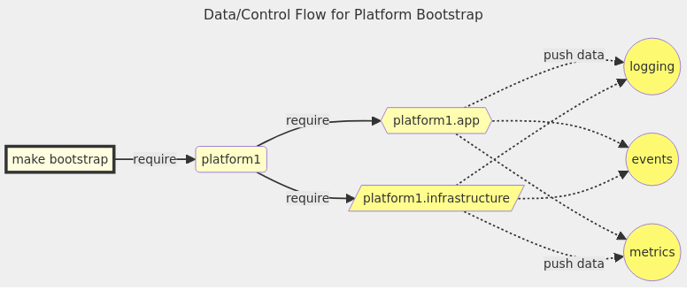

<table align=center style="width:100%">
  <tr>
    <td colspan=2><strong>k8s-tools </strong>&nbsp;&nbsp;&nbsp;&nbsp;
    </td>
  </tr>
  <tr>
    <td align=center width=10%>
      <center>
        <br/>
        <br/>
        <br/>
      </center>
    </td>
    <td width=90%>
      <table align=center border=1>
        <tr align=center><td align=center width="13%"><a href=/README.md#overview>Overview</a></td>
<td align=center width="13%"><a href=/README.md#features>Features</a></td>
<td align=center width="13%"><a href=/README.md#integration>Integration</a></td>
<td align=center width="13%"><a href=/README.md#composemk>compose.mk</a></td>
<td align=center width="13%"><a href=/README.md#k8smk>k8s.mk</a></td>
<td align=center width="13%"><a href=/docs/api/>API</a></td>
<td align=center width="13%"><a href=/docs/demos>Demos</a></td></tr>
      </table>
      <hr style="border-bottom:1px solid black;"><center><span align=center>&nbsp;<a href="https://github.com/elo-enterprises/k8s-tools/actions/workflows/docker-test.yml"></a>&nbsp;<a href="/docs/env-vars.md"></a>&nbsp;<a href="/docs/env-vars.md"></a>&nbsp;<a href="/docs/env-vars.md"></a>&nbsp;<a href="/docs/env-vars.md"></a>&nbsp;<a href="/docs/env-vars.md"></a>&nbsp;<a href="/docs/env-vars.md"></a>&nbsp;<a href="/docs/env-vars.md"></a>&nbsp;<a href="/docs/env-vars.md"></a>&nbsp;<a href="/docs/env-vars.md"></a>&nbsp;<a href="/docs/env-vars.md"></a>&nbsp;<a href="/docs/env-vars.md"></a>&nbsp;<a href="/docs/env-vars.md"></a>&nbsp;<a href="/docs/env-vars.md"></a>&nbsp;<a href="/docs/env-vars.md"></a>&nbsp;<a href="/docs/env-vars.md"></a>&nbsp;&nbsp;<a href="/docs/env-vars.md"></a>&nbsp;<a href="/docs/env-vars.md"></a>&nbsp;</span></center><hr style="border-bottom:1px solid black;">
    </td>
  </tr>
</table><center><span align=center>Completely dockerized version of a kubernetes toolchain, plus a zero-dependency automation framework for extending and interacting it.  Project-local clusters, customized TUIs, and more.</span></center><hr style="border-bottom:1px solid black;">


--------------------------------

<p align="center"><a href="img/e2e-k3d.commander.gif"></a></p>

--------------------------------

<div class="toc">
<ul>
<li><a href="#overview">Overview</a></li>
<li><a href="#features">Features</a></li>
<li><a href="#quick-start">Quick Start</a><ul>
<li><a href="#clonebuildtest-this-repo">Clone/Build/Test This Repo</a></li>
<li><a href="#tools-via-compose-cli">Tools via Compose CLI</a></li>
<li><a href="#tools-via-make">Tools via Make</a></li>
</ul>
</li>
<li><a href="#integration-with-your-project">Integration With Your Project</a><ul>
<li><a href="#embedding-tools-with-aliases">Embedding Tools With Aliases</a></li>
<li><a href="#embedding-tools-with-makefiles">Embedding Tools With Makefiles</a></li>
<li><a href="#stand-alone-tools">Stand-Alone Tools</a></li>
</ul>
</li>
<li><a href="#composemk">compose.mk</a><ul>
<li><a href="#but-why">But Why?</a></li>
<li><a href="#makecompose-bridge">Make/Compose Bridge</a></li>
<li><a href="#dynamic-api">Dynamic API</a></li>
<li><a href="#makecompose-bridge-with-k8s-toolsyml">Make/Compose Bridge with k8s-tools.yml</a></li>
<li><a href="#container-dispatch">Container Dispatch</a></li>
<li><a href="#macro-arguments">Macro Arguments</a></li>
<li><a href="#container-dispatch-syntaxsemantics">Container Dispatch Syntax/Semantics</a></li>
<li><a href="#multiple-compose-files">Multiple Compose Files</a></li>
<li><a href="#loading-compose-files">Loading Compose Files</a></li>
<li><a href="#embedded-tui">Embedded TUI</a></li>
</ul>
</li>
<li><a href="#k8smk">k8s.mk</a><ul>
<li><a href="#automation-apis-over-tool-containers">Automation APIs over Tool Containers</a></li>
<li><a href="#but-why_1">But Why?</a></li>
<li><a href="#api-k8smk">API: k8s.mk</a></li>
</ul>
</li>
<li><a href="#demos">Demos</a><ul>
<li><a href="#demo-cluster-automation">Demo: Cluster Automation</a></li>
<li><a href="#demo-platform-setup">Demo: Platform Setup</a></li>
</ul>
</li>
<li><a href="#known-limitations-and-issues">Known Limitations and Issues</a></li>
</ul>
</div>


--------------------------------

## Overview

**This repository aggregates 20+ individual utilities for working with kubernetes into one dockerized toolchain, hosted inside a single compose file as [k8s-tools.yml](k8s-tools.yml).**  It's useful for CI/CD pipelines or general development, and can be [embedded alongside your existing project](#integration-with-your-project), which helps to fix the problem of different project developers using different local versions of things like `helm`, `kubectl`, etc.

Containers defined here aren't built from scratch, and official sources are used where possible.  Low-level tools (like `kubectl`, `helm`, etc) mostly come from [alpine/k8s](https://hub.docker.com/r/alpine/k8s) but [many other tools](#features) (like `argo`, `k9s`, `k3d`, etc) are also included.  However, *this isn't an attempt to build an omnibus "do-everything" container..* it's more a response to the fact that there are a lot of diverse tools that really can't be unified, so it's better to just learn how to work with that.  Tools containers are versioned independently, and pulled only when they are used.

**Besides bundling some tooling, this repository is a reference implementation** for a pattern that [bridges compose services and Makefile targets](#composemk), describing a "minimum viable automation-framework" for [orchestrating tasks across tool containers](#container-dispatch).  It's expressive and flexible, yet also focused on minimizing both conceptual overhead and software dependencies.  It's incredibly useful for lots of things, and whether it is a tool, a library, or a framework  depends on how you decide to use it.  

This reference focuses on a few use-cases in particular:

1. Cluster lifecycle / development / debugging workflows in general.
1. Decoupling project automation from the choice of CI/CD backend.
1. Project-local kubernetes clusters & corresponding lifecycle automation using kind or k3d.
1. Proper separation of automation tasks from specifications for runtime / container context.
1. Less shell code in general, but where we need it: it <u>shouldn't</u> be embedded in YAML, Jenkinsfiles, etc.
1. Per-project tool-versioning, providing defaults but allowing overrides, and ensuring versions match everywhere.
1. Generally modernizing & extending `make` for containers, colors, and concurrency, making it ready for the 21st Century.

There's a lot of hate for `make` (especially for "creative" usage of it!), but you'll find that these are not the Makefile's of your ancestors.  Support for [container dispatch](#container-dispatch) feels like a tiny, unobtrusive DSL on top of tech you already know, and you can run it anywhere you are.  Less time spent negotiating with bolted-on plugin-frameworks, hook systems, and build-bots, more time for the problems you care about.  And yes, *the build-bots themselves will be happy to run your automation.*  See the [this repo's github actions](https://github.com/elo-enterprises/k8s-tools/actions?query=branch%3Amaster), which bootstrap and exercise a cluster as part of the [end to end tests](#demo-cluster-automation).

**Working with [compose.mk](#composemk) and [k8s.mk](#k8smk) makes `make` hit different.**  

Beyond addressing the issues above, these tools add new capabilities to `make` itself, including some support for [quickly building custom TUIs](#embedded-tui).  

<table>
    <tr>
        <td></td>
        <td></td>
        <td></td>
    </tr>
    </table>
<p align="center"><a href="img/e2e-k3d.commander.gif"></a></p>

With or without the TUI, all output is carefully curated, aiming to be readable and human-friendly while still remaining machine-friendly for downstream processing.


--------------------------------


## Features

[k8s-tools.yml](#) | [compose.mk](#) | [k8s.mk](#)

**[k8s-tools.yml](k8s-tools.yml)** is a compose file with 20+ container specifications covering popular platforming tools and other utilities for working with Kubernetes.  This file makes use of the [dockerfile_inline directive](https://docs.docker.com/compose/compose-file/build/#dockerfile_inline), plus the fact that tool-containers  *tend to involve layering really small customizations*.  Now you can version these tools explicitly, customize them if you need to, and still avoid having N Dockerfiles cluttering up your whole repository.  Here's a quick overview of the manifest and some details about versioning:

* **Local parts of the tool bundle** ([See the latest here](k8s-tools.yml))
  * <ins>Cluster management:</ins> [kind](https://github.com/kubernetes-sigs/kind), [k3d](https://k3d.io/)
  * <ins>Workflows, FaaS, and Misc Platforming Tools:</ins> [argocli](https://argo-workflows.readthedocs.io/en/latest/walk-through/argo-cli/), [kn](https://knative.dev/docs/client/install-kn/), [fission](https://fission.io/docs/installation/), [rancher](https://github.com/rancher/cli)
  * <ins>Lower-level helpers:</ins> [helmify](https://github.com/arttor/helmify), [kompose](https://kompose.io/), [kubefwd](https://github.com/txn2/kubefwd)
  * <ins>Monitoring and metrics tools:</ins> [promtool](https://prometheus.io/docs/prometheus/latest/command-line/promtool/), [k9s](https://k9scli.io/), [lazydocker](https://github.com/jesseduffield/lazydocker)
  * <ins>Krew plugins:</ins> [sick-pods](https://github.com/alecjacobs5401/kubectl-sick-pods), [ktop](https://github.com/vladimirvivien/ktop), [kubectx, and kubens](https://github.com/ahmetb/kubectx) available by default, and more on demand.
  * <ins>TUI and user-messaging utilities</ins>: [gum](https://github.com/charmbracelet/gum), [pv](https://www.ivarch.com/programs/pv.shtml), [spark](https://raw.githubusercontent.com/holman/spark/)
  * <ins>General Utilities:</ins> Fixed (i.e. non-busybox) versions of things like date, ps, uuidgen, etc
* **Upstream parts of the tool bundle** ([See the latest here](https://github.com/alpine-docker/k8s/blob/master/README.md#installed-tools) for more details on that.)
  * <ins>Cluster management:</ins> [eksctl](https://github.com/weaveworks/eksctl)
  * <ins>Core Utilities:</ins> [kubectl](https://kubernetes.io/docs/tasks/tools/install-kubectl/), [kustomize](https://github.com/kubernetes-sigs/kustomize), [helm](https://github.com/helm/helm), [krew](https://github.com/kubernetes-sigs/krew)
  * <ins>Misc Utilities:</ins> [helm-diff](https://github.com/databus23/helm-diff), [helm-unittest](https://github.com/helm-unittest/helm-unittest), [helm-push](https://github.com/chartmuseum/helm-push), [kubeseal](https://github.com/bitnami-labs/sealed-secrets), [vals](https://github.com/helmfile/vals), [kubeconform](https://github.com/yannh/kubeconform)
  * <ins>Cloud Utilities:</ins> [awscli v1](https://github.com/aws/aws-cli), [aws-iam-authenticator](https://github.com/kubernetes-sigs/aws-iam-authenticator)
  * <ins>General Utilities:</ins> Such as bash, curl, jq, yq, etc
* **Versioning for Tools:**
  * *Tooling in the local bundle is all versioned independently:*
    * Defaults are provided, but [overrides allowed from environment variables](docs/env-vars.md#k8stoolsyml).
  * *Upstream tool versioning is determined by the alpine-k8s base,*
    * But *k8s-tools.yml* has service-stubs and layout that can be easily changed if you need something specific.
* **Other Features:**
  * *Just-in-Time & On-Demand:*
    * As usual with docker-compose, containers aren't pulled until they are used, and build-when-changed mostly works as you'd expect.
    * *Having these declared in case of eventual use won't saddle you with an enormous bootstrap process!*
  * *Sane default volumes for tool-containers,* including:
    * Sharing the working directory, docker socket, and kubeconfigs for you automatically.  
  * *Fixes docker file-permissions for root-user containers* (probably).  
    * Seems to work pretty well in Linux and Mac ([more details](#docker-and-file-permissions)).
  * 🚀 *Executable file:*  
    * `./k8s-tools.yml ...  <==> docker compose -f k8s-tools.yml ...`

The focus for k8s-tools.yml is to stand alone with no host dependencies, not even Dockerfiles, yet provide boilerplate that's parametric enough to work pretty well across different projects, without changing the compose file.  If the default tool versions don't work for your use-cases, [k8s-tools.yml probably has an environment variable you can override](#environment-variables).

-------

After you've made your whole tool chain portable in one swipe, you might also be interested in *driving* those tools with something that offers more structure than a shell script, and something that also *won't add to your dependencies*.  If that sounds interesting, you might like to meet `compose.mk` and `k8s.mk`.

<ins>**[compose.mk](#composemk)**, a Makefile automation library / CLI tool, defining targets and macros for working with compose files & services.</ins>  The main focus for `compose.mk` is providing the `compose.import` macro so that you can write automation that works with tool containers, but there are other reasons you might be interested, including a workflow library and an embedded framework for quickly building customized TUIs.  

* **Importing Compose Services:**
  * **Tool containers can be 'imported' as a group of related make-targets.**
    * Interact with them using the [Make/compose bridge](#makecompose-bridge)
    * [Use container-dispatch syntax](#container-dispatch) to run existing make-targets **inside** tool containers
    * Use the containers effectively from "outside", or drop into debugging shell "inside"
  * **Tool containers can be anything, defined anywhere:**
      * No explicit dependency for k8s-tools.yml
      * [Multiple compose-files are supported](#multiple-compose-files)
* **Other Features:** 
  * **[Curated collection of reusable utility targets](#composemk-api)**, which are arranged into a few namespaces:
    * [**`flux.*` targets:**](/docs/api#api-flux) A tiny but powerful workflow/pipelining API, roughly comparable to something like [declarative pipelines in Jenkins](https://www.jenkins.io/doc/book/pipeline/syntax/).  This provides concurrency/staging operators that compose over make-target names.
    * [**`stream.*`:**](/docs/api#api-stream) Primitives for working with streams, including support for newline/comma/space delimited streams, common use cases with JSON, etc.  Everything here is used with pipes, and reads from stdin.  It's not what you'd call "typed", but it reduces error-prone parsing and moves a little bit closer to structured data.
    * [**`docker.*`:**](/docs/api#api-docker) A small interface for working with docker.  
    * [**`io.*`:**](/docs/api#api-io) Misc. utilities for printing, formatting, timers, etc.
    * [**`tux.*` targets:**](#) Control-surface for a tmux-backed console geometry manager.
      * **No host dependencies.** This uses the `compose.mk:tux` tool container to dockerize tmux itself.
      * **Supports docker-in-docker style host-socket sharing with zero configuration,** so your TUI can generally do all the same container orchestration tasks as the docker host.
      * Open split-screen displays, shelling into 1 or more of the tool containers in k8s-tools.yml (or any other compose file).
      * Combines well with `flux.*` targets to quickly create dashboards / custom development environments.
  * 🚀 *Executable file:*
    * `./compose.mk ...  <==> make -f compose.mk ...`

-------

<ins>**[k8s.mk](#k8smk)**, a Makefile automation library/CLI tool, defining various targets for working with Kubernetes.</ins>  The main focus is building on the functionality of containers in k8s-tools.yml and compose.mk's ability to automate and orchestrate them.
Both `compose.mk` and `k8s-tools.yml` files are a soft-dependency for `k8s.mk`, because the emphasis is on seamless usage of those containers.  But you can still use many targets "natively" if your host already has the relevant tools.  It also provides some primitives for common tasks (like waiting for all pods to be ready), context management (like setting the active namespace), the usual patterns (like idempotent usage of `helm`), and the automate the TUI itself (like sending specific targets to specific panes).

* **Main features:**
  * Useful as a library, especially if you're building cluster lifecycle automation
  * Useful as an interactive debugging/inspection/development tool.
  * Do the common tasks quickly, interactively or from other automation
    * Launch a pod in a namespace, or a shell in a pod, without lots of kubectling
    * Stream and pipe commands to/from pods, or between pods
* **Other Features:** 
  * **[Curated collection of automation interfaces](#k8smk-api)**, arranged into a few namespaces:
    * [**`k8s.*` targets:**](/docs/api#api-k8s) Default namespace with debugging tools, cluster life-cycle primitives, etc.
    * Plus more specific interfaces to [k3d](#), [kubefwd](#), etc. [Full API here.](#k8smk-api)
  * 🚀 *Executable file:*
    * `./k8s.mk ...  <==> make -f k8s.mk ...`


--------------------------------

## Quick Start

### Clone/Build/Test This Repo

```bash
# for ssh
$ git clone git@github.com:elo-enterprises/k8s-tools.git

# or for http
$ git clone https://github.com/elo-enterprises/k8s-tools

# build the tool containers & check them
$ make clean build test
```

----------------------------------------------------

### Tools via Compose CLI

```bash
$ docker compose run -f k8s-tools.yml argo ...
$ docker compose run -f k8s-tools.yml awscli ...
$ docker compose run -f k8s-tools.yml aws-iam-authenticator ...
$ docker compose run -f k8s-tools.yml dind ...
$ docker compose run -f k8s-tools.yml eksctl ...
$ docker compose run -f k8s-tools.yml fission ...
$ docker compose run -f k8s-tools.yml graph-easy ...
$ docker compose run -f k8s-tools.yml gum ...
$ docker compose run -f k8s-tools.yml helm ...
$ docker compose run -f k8s-tools.yml helm-diff ...
$ docker compose run -f k8s-tools.yml helmify ...
$ docker compose run -f k8s-tools.yml helm-push ...
$ docker compose run -f k8s-tools.yml helm-unittest ...
$ docker compose run -f k8s-tools.yml jq ...
$ docker compose run -f k8s-tools.yml k3d ...
$ docker compose run -f k8s-tools.yml k8s ...
$ docker compose run -f k8s-tools.yml k9s ...
$ docker compose run -f k8s-tools.yml kind ...
$ docker compose run -f k8s-tools.yml kn ...
$ docker compose run -f k8s-tools.yml kompose ...
$ docker compose run -f k8s-tools.yml krew ...
$ docker compose run -f k8s-tools.yml kubeconform ...
$ docker compose run -f k8s-tools.yml kubectl ...
$ docker compose run -f k8s-tools.yml kubefwd ...
$ docker compose run -f k8s-tools.yml kubeseal ...
$ docker compose run -f k8s-tools.yml kustomize ...
$ docker compose run -f k8s-tools.yml lazydocker ...
$ docker compose run -f k8s-tools.yml promtool ...
$ docker compose run -f k8s-tools.yml rancher ...
$ docker compose run -f k8s-tools.yml tui ...
$ docker compose run -f k8s-tools.yml vals ...
$ docker compose run -f k8s-tools.yml yq ...
```

----------------------------------------------------

### Tools via Make 

Commands like this will work at the repository root to interact with the tool containers in k8s-tools.yml:

```bash
# run kubectl, which can be used directly or with pipes 
$ cmd='apply -f my-manifest.yml' make kubectl
$ cat my-manifest.yml | make kubectl/pipe cmd='apply -f -'

# run helmify (which expects stdin)
$ cat my-manifest.yml | make helmify/pipe

# drop to a shell to work with helm container (interactive; plus '.' is already volume-shared)
$ make helm/shell

# get cluster info from k3d
$ make k3d cmd='cluster list -o json'

# equivalently 
$ echo k3d cluster list -o json | make k3d/shell/pipe
```

For more details about targets that are **autogenerated for tool containers in the compose-spec**, how this works in general, and what else you can do with it.. check out the docs for [the Make/Compose bridge](#makecompose-bridge).  There are various static-targets available too, [see the API docs for compose.mk](#static-targets-for-composemk).

Building on the capabilities of those tool-containers, here's some random examples of using k8s.mk.  

```bash
# KUBECONFIG should already be set!
# wait for all pods in all namespaces
$ make k8s.wait

# start a debugging shell in the 'default' namespace and attach to it (interactive)
$ make k8s.test_harness/default/my-test-harness 
$ make k8s.shell/default/my-test-harness

# run k9s TUI for the given namespace (intreractive)
$ make k9s/my-namespace
```

For the full documentation of those targets, see [k8s.mk API](/docs/api/#api-k8smk).

This repository includes lots of examples for make/compose integration in general, and in particular how you can accomplish lifecycle scripting with k8s.mk.

* For advanced usage that builds automation APIs by running targets *inside* tool containers, see [the dispatch-demo](#container-dispatch).
* For a more involved tutorial [see the cluster-lifecycle demo](#demo-cluster-automation).
* For examples, you can also the [integration tests](tests/Makefile.itest.mk) and [end-to-end tests](tests/Makefile.e2e.mk).  
* For a complete, external project that uses this approach for cluster automation, see [k3d-faas.git](https://github.com/elo-enterprises/k3d-faas)

----------------------------------------------------

## Integration With Your Project

You can embed the k8s-tools suite in your project in two ways, either with some kind of global compose file and global aliases, or with a more project-based approach using Makefiles.

----------------------------------------------------

### Embedding Tools With Aliases

To use this pattern with your existing projects, you might want to maintain separated compose files and setup aliases.

```bash
$ cd myproject

# or use your fork/clone..
$ curl -sL https://raw.githubusercontent.com/elo-enterprises/k8s-tools/master/k8s-tools.yml > k8s-tools.yml

$ alias helm=docker compose -f myproject/k8s-tools.yml run helm

$ helm ....
```

Aliases are convenient but rather fragile (obviously this will break if you move your `myproject` folder around).  See the next section for something that is a more durable and flexible.

----------------------------------------------------

### Embedding Tools With Makefiles

You'll probably want to read over the [compose.mk](#composemk) section to understand what's going on here.  In case you've already seen it though, here's the quick start with the copy/paste stuff.


First, copy the files from this repo into your project:

```bash
$ cd myproject 

# Download the compose file with the tool containers
$ curl -sL \
  https://raw.githubusercontent.com/elo-enterprises/k8s-tools/master/k8s-tools.yml \
    > k8s-tools.yml

# Download the compose.mk automation lib
$ curl -sL \
  https://raw.githubusercontent.com/elo-enterprises/k8s-tools/master/compose.mk \
    > compose.mk

# Optional.  
# Download the k8s.mk automation lib.
$ curl -sL \
  https://raw.githubusercontent.com/elo-enterprises/k8s-tools/master/k8s.mk \
    > k8s.mk
```

These 3 files are usually working together, but in some cases they are useful in a stand-alone mode.  Make them all executable if you want to use that:

```bash
$ chmod ugo+x k8s-tools.yml compose.mk k8s.mk

# equivalent to `make -f k8s.mk ..`
./k8s.mk ... # ===> 

# equivalent to `make -f compose.mk ..`
$ ./compose.mk ... ===> 

# equivalent to `docker compose -f k8s-tools.yml run ...`
$ ./k8s-tools.yml run ...
```

If you're interested in setting up the [Make/Compose bridge](#makecompose-bridge) or preparing for [Container Dispatch](#container-dispatch), here's and example of what your Makefile should look like:

```Makefile
# myproject/Makefile (Make sure you have real tabs, not spaces!)
 
# Include/invoke the target-building macros 
# somewhere near the top of your existing boilerplate
include compose.mk
$(eval $(call compose.import, ▰, TRUE, k8s-tools.yml))

# At this point, targets are defined for whatever services
# are mentioned in the external compose config, and they are
# ready to use. Now you can dispatch any task to any container!
test: ▰/k8s/self.test
self.test:
  kubectl --version
  echo hello world from `uname -n -v`
```


----------------------------------------------------

### Stand-Alone Tools

If you're not interested in custom automation that requires project-Makefile integration, some features of `compose.mk` and `k8s.mk` can be used without that.  See the docs for [Loading Compose Files](#loading-compose-files) for more details.

----------------------------------

## compose.mk

A tool / library / automation framework for working with containers.

  * Library-mode extends `make`, adding native support for working with (external) container definitions
  * Stand-alone mode also available, i.e. a tool that requires no external Makefile / compose file.
  * A small-but-powerful built-in TUI framework with no host dependencies. (See the [Embedded TUI docs](#embedded-tui) and the [tux.* API](/docs/api#api-tux))
  * **Zero host-dependencies,** as long as you have docker + make.  Even the [TUI backend](#embedded-tui) is dockerized.
  * **Container-dependencies are minimal too,** so that almost any base can work with [container-dispatch](#container-dispatch).
  * A minimal, elegant, and dependency-free approach to describing workflow pipelines. (See the [flux.* API](/docs/api#api-flux))

**In library Mode,** `compose.mk` is used as an `include` from your project Makefile.  With that as a starting place, you can **[build a bridge between docker-compose services and make-targets](#makecompose-bridge)** and use [**minimum viable patterns for container-dispatch.**](#container-dispatch).  The main macro is called *`compose.import`*, which can be used/included from any Makefile, used with any compose file, and [used with *multiple* compose files](#multiple-compose-files).  


If you prefer to learn from examples, you might want to just [get started](#makecompose-bridge) or skip to the main [cluster automation demo](#demo-cluster-automation) or to a [tui demo](#demo-tui).  If you're the type that needs to hear the motivation first, read on in the next section.

----------------------------------------------------

### But Why?

There's many reasons why you might want these capabilities if you're working with tool-containers, builds, deploys, and complex task orchestration.  People tend to have strong opions about this topic, and it's kind of a long story.  

The short version is this: Makefiles run practically everywhere and most people can read/write them.  They're also really good at describing DAGs, and lots of automation, but *especially life-cycle automation*, is a natural fit for this paradigm.  The only trouble is that **a)** *make has nothing like native support for tasks in containers*, and **b)** *describing the containers themselves is even further outside of its domain*.  Meanwhile, docker-compose is exactly the opposite.  
Make & Compose are already a strong combination for this reason, and by adding some syntactic sugar using compose.mk, you can orchestrate make-targets across several containers without cluttering your host.  More than that.. you can also bootstrap surprisingly sophisticated automation-APIs with surprisingly little effort.

If you're interested in the gory details of a longer-format answer, see [the Design Philosophy docs](docs/but-why.md).

----------------------------------------------------


### Make/Compose Bridge

*`compose.mk`* provides lots of interfaces (i.e. automatically generated make targets) which are suitable for interactive use.  

Let's set aside the tool containers described inside k8s-tools.yml for now and walk through a much more minimal example, starting with a hypothetical compose file:

```yaml 
# example docker-compose.yml
services:
  debian:
    image: debian
  alpine:
    image: alpine 
```

Next, the Makefile.  To generate make-targets for every service in the given compose file, we just need to import the `compose.import` macro and call it.

```Makefile
# Inside your project Makefile
include compose.mk
$(eval $(call compose.import, ▰, TRUE, docker-compose.yml))
```

The arguments *`(▰, TRUE)`* above allow for control of namespacing and syntax.  *(More on that later in the [Macro Arguments section](#macro-arguments).)*  The final argument is just the (unquoted) name of the file you want to import services from.  

That's it for the Make/Compose boilerplate, but we already have lots of interoperability.  

### Dynamic API

In general, the autogenerated targets created by [the bridge described above](#make-compose-bridge) fall into these categories:

Assuming `compose.import` was allowed to import to the root namespace:

* [**`<svc_name>`**](#target-svc_name)
* [**`<svc_name>`/shell**](#target-svc_nameshell)
* [**`<svc_name>`/shell/pipe**](#target-svc_nameshellpipe)
* [**`<svc_name>`/get_shell**](#target-svc_namespecial)

Assuming `compose.import` was used at all:

* [**`<compose_stem>`.services**](#target-compose_stemspecial)
* [**`<compose_stem>`.build**](#target-compose_stemspecial)
* [**`<compose_stem>`.clean**](#target-compose_stemspecial)
* [**`<compose_stem>`/`<svc>`**](#target-svc_nameshell)

See the sections below for more concrete examples.

#### Target: **`<svc_name>`/shell** 

The **`<svc_name>`/shell** target drops to a containter shell for the named service, and is usually interactive.

```bash 

# Interactive shell on debian container
$ make debian/shell

# Interactive shell on "alpine" container
$ make alpine/shell
```


----------------------------------------------------

#### Target: **`<svc_name>`/shell/pipe** 

The **`<svc_name>`/shell/pipe** target allows streaming data:

```bash
# Stream commands into debian container
$ echo uname -n -v | make debian/shell/pipe

# Equivalent to above, since the debian image's default entrypoint is bash
$ echo uname -n -v | make debian/pipe

# Streams command input / output between containers
echo echo echo hello-world | make alpine/pipe | make debian/pipe
```


----------------------------------------------------

#### Target: **`<svc_name>`** 

The top-level **`<svc_name>`** target is more generic and can be used without arguments, or with optional explicit overrides for the compose-service defaults.  Usually this isn't used directly, but it's sometimes useful to call from automation.  Indirectly, most other targets are implemented using this target.

```bash 
# Runs an arbitrary command on debian container (overriding compose defaults)
$ entrypoint=ls cmd='-l' make debian

# Streams data into an arbitrary command on alpine container
$ echo hello world | pipe=yes entrypoint=cat cmd='/dev/stdin' make alpine
```

----------------------------------------------------

#### Target: **`<svc_name>`/`<special>`**

Besides targets for working *with* services there are targets for answering questions *about* services.

The *`<svc_name>/get_shell`* targets answers what shell can be used as an entrypoint for the container. Usually this is `bash`, `sh`, or an error, but when there's an answer you'll get it in the form of an absolute path.

```bash

$ make debian/get_shell
/bin/bash
```

----------------------------------------------------

#### Target: **`<compose_stem>/<svc>`**

Namespaced aliases are also available. Due to the file-stem of the compose file we imported, all of the stuff above will work on targets like you see below.

```bash
$ make docker-compose/debian
$ make docker-compose/debian/shell
```

Note that if `compose.import` uses a file name like `k8s-tools.yml` instead, the namespace is *`k8s-tools/<svc_name>`*.

----------------------------------------------------

#### Target: **`<compose_stem>`.`<cmd>`**

Besides targets for working with compose-services, some targets work on the compose file itself.  Assuming your compose file is named `docker-compose.yml`, the special targets work like this:

```bash 

# Build (equivalent to `docker compose -f docker-compose.yml build`)
make docker-compose.build

# Build (equivalent to `docker compose -f docker-compose.yml stop`)
make docker-compose.stop

# Clean (equivalent to `docker compose -f docker-compose.yml down --remove-orphans`)
make docker-compose.clean

# List all services defined for file (Array of strings, xargs-friendly)
make docker-compose.services
```

Using the `<compose_stem>.services` target, it's easy to map a command onto every container.  Try something like this:

```bash 
$ make docker-compose.services | xargs -n1 -I% sh -x -c "echo uname -n |make docker-compose/%/shell/pipe"
```

----------------------------------------------------

### Make/Compose Bridge with k8s-tools.yml

This repo's [Makefile](Makefile) uses compose.mk macros to load services from [k8s-tools.yml](k8s-tools.yml), so that [the targets available at the project root](#tools-via-make) are similar to the ones above, but will use names like *`k8s, kubectl, k3d`* instead of *`debian, alpine`*, and will use *`k8s-tools/`* prefixes instead of *`docker-compose/`* prefixes.

```bash 

$ make k8s-tools.services
argo
awscli
aws-iam-authenticator
dind
eksctl
fission
graph-easy
gum
helm
helm-diff
helmify
helm-push
helm-unittest
jq
k3d
k8s
k9s
kind
kn
kompose
krew
kubeconform
kubectl
kubefwd
kubeseal
kustomize
lazydocker
promtool
rancher
tui
vals
yq
```

```bash 
$ echo k3d --version | make k8s-tools/k3d/shell/pipe 
k3d version v5.6.3
k3s version v1.28.8-k3s1 (default)
```

```bash 
$ make k8s/shell
⇒ k8s-tools/k8s/shell (entrypoint=/bin/bash)
▰ // k8s-tools // k8s container
▰ [/bin/bash] ⋘ <interactive>
k8s-base:/workspace$ 
```

See also the [TUI docs](#embedded-tui) for examples of opening up multiple container-shells inside a split-screen display.

----------------------------------------------------


### Container Dispatch

Let's look at a more complicated example where we want to use make to dispatch commands *into* the compose-service containers.  For this we'll have to change the boilerplate somewhat as we add more functionality.

```Makefile
# Makefile (make sure you have real tabs, not spaces)

include compose.mk
$(eval $(call compose.import, ▰, TRUE, docker-compose.yml))

# New target declaration that we can use to run stuff
# inside the `debian` container.  The syntax conventions
# are configured by the `compose.import` call we used above.
demo: ▰/debian/self.demo

# Displays platform info to show where target is running.
# Since this target is intended to be private, we will 
# prefix "self" to indicate it should not run on host.
self.demo:
	source /etc/os-release && printf "$${PRETTY_NAME}\n"
	uname -n -v
```

The example above demonstrates another automatically generated target that uses some special syntax: `▰/<svc_name>/<target_to_dispatch>`.  This is just syntactic sugar that says that running `make demo` on the host runs `make self.demo` on the debian container.  Calling the top-level target looks like this:


What just happend?  If we unpack the syntactic sugar even more, you could say that the following are roughly equivalent:

```bash
# pithy invocation with compose.mk
$ make demo

# the verbose alternative invocation
$ docker compose -f docker-compose.yml \
    run --entrypoint bash debian -c "make self.demo"
```

Let's add another target to demonstrate dispatch for multiple containers:

```Makefile
# Makefile (make sure you have real tabs, not spaces)

include compose.mk
$(eval $(call compose.import, ▰, TRUE, docker-compose.yml))

# User-facing top-level target, with two dependencies
demo-double-dispatch: ▰/debian/self.demo ▰/alpine/self.demo

# Displays platform info to show where target is running.
# Since this target is intended to be private, we will 
# prefix "self" to indicate it should not run on host.
self.demo:
	source /etc/os-release && printf "$${PRETTY_NAME}\n"
	uname -n -v
```

The *`self`* prefix is just a convention, more on that in the following sections.  The above looks pretty tidy though, and hopefully helps to illustrate how the target/container/callback association works.  Running that looks like this:


Meanwhile, the equivalent-but-expanded version below is getting cluttered, plus it breaks when files move or get refactored.

```bash
# pithy invocation with compose.mk
$ make demo-double-dispatch 

# verbose, fragile alternative
$ docker compose -f docker-compose.yml \
    run --entrypoint bash debian -c "make self.demo" \
  && docker compose -f docker-compose.yml \
    run --entrypoint bash alpine -c "make self.demo"
```

<ins>**This simple pattern for dispatching targets in containers is the main feature of `compose.mk` as a library, and it's surprisingly powerful.**</ins>  The next sections will cover macro arguments, and dispatch syntax/semantics in more detail.  If you're interested in a demo of how you can use this with k8s-tools.yml, you can skip to [this section](#cluster-automation-demo).

Container-dispatch with `compose.mk` can also autodetect what shell to use with the container (via the [`<svc_name>/get_shell` target](#target-svc_namespecial)).  Even better, the Makefile-based approach scales to lots of utility-containers in separate compose files, and can detect and prevent whole categories of errors (like typos in the name of the compose-file, service name, entrypoint, etc) at the start of a hour-long process instead of somewhere in the middle.  (See [docs for `make --reconn`](https://www.gnu.org/software/make/manual/html_node/Instead-of-Execution.html) to learn more about dry-runs).  If you are thoughtful about the ways that you're using volumes and file state, you can also consider using [`make --jobs` for parallel execution](https://www.gnu.org/software/make/manual/make.html#Parallel-Execution).

**To make this work as expected though, we do have to add more stuff to the compose file.**  In practice the containers you use might be ready, but if they are slim, perhaps not.  Basically, **if the subtarget is going to run on the container, the container needs to at least have:**  `make`, `bash` (or whatever shell the Makefile uses), and a volume mount to read the `Makefile`.  

```yaml
##
# tests/docker-compose.yml: 
#  A minimal compose file that works with target dispatch
##
services:
  debian: &base
    hostname: debian
    build:
      context: .
      dockerfile_inline: |
        FROM debian
        RUN apt-get update && apt-get install -y make procps
    entrypoint: bash
    working_dir: /workspace
    volumes:
      - ${PWD}:/workspace
  ubuntu: 
    <<: *base
    hostname: ubuntu
    build:
      context: .
      dockerfile_inline: |
        FROM ubuntu
        RUN apt-get update && apt-get install -y make procps
  alpine:
    <<: *base
    hostname: alpine
    build:
      context: .
      dockerfile_inline: |
        FROM alpine
        RUN apk add --update --no-cache coreutils alpine-sdk bash procps-ng

```

The debian/alpine compose file above and most of the interfaces described so far are all exercised inside [this repo's test suite](tests/).

----------------------------------------------------

### Macro Arguments

Make isn't big on named-arguments, so let's unpack the `compose.import` macro invocation.

```Makefile
include compose.mk
$(eval $(call compose.import, ▰, TRUE, docker-compose.yml))
```

 **The 1st argument for `compose.import` is called `target_namespace`**.  You can swap the unicode for `▰` out, opting instead for different symbols, path-like prefixes, whatever.  If you're bringing in services from several compose files, one way to control syntax and namespacing is to use different symbols for different calls to `compose.import`.  (For a 2-file example, see the [Multiple Compose Files](#multiple-compose-files) section.)

**The 2nd argument for `compose.import` controls whether service names are available as top-level Makefile targets.**  The only value that means True is *`TRUE`*, because Make isn't big on bool types.  Regardless of the value here, service targets are always under `<compose_file_stem>/<compose_service_name>`. 

**The last argument for `compose.import` is the compose-file to load services from.**  It will be tempting to quote this and the other arguments, but that won't work, so resist the urge!


----------------------------------------------------

### Container Dispatch Syntax/Semantics

Let's look at the container-dispatch example in more detail.  This isn't a programming language you've never seen before, it's just a (legal) Makefile that uses unicode symbols in some of the targets.  

```Makefile
# A target that runs stuff inside the `debian` container, runs from host using `make demo`
demo: ▰/debian/self.demo

# Dispatching 1 target to 2 containers looks like this
demo-dispatch: ▰/debian/self.demo ▰/alpine/self.demo

# Displays platform info to show where target is running.
self.demo:
	source /etc/os-release && printf "$${PRETTY_NAME}\n"
	uname -n -v
```

The suggested defaults here will annoy some people, but the syntax is configurable, and this hopefully won't collide with existing file paths or targets.  Using the *`self`* prefix is just a convention that you can change, but having some way to guard the target from accidental execution on the host is a good idea.  This decorator-inspired syntax is also creating a convention similar to the idea of private methods: *`self`* hopefully implies internal/private, and it's not easy to type the weird characters at the command line.  So users likely won't think to call anything except `make demo`.  For people reading the code, the visual hints make it easy to understand what's at the top-level.

But what about the semantics?  In this example, the user-facing `demo` target depends on `▰/debian/demo`, which isn't really a target as much as a declaration.  The declaration means the *private* target `self.demo`, will be executed inside the `debian` container that the compose file defines.  *Crucially, the `self.demo` target can use tools the host doesn't have, stuff that's only available in the tool container.*  

Look, no `docker run ..` clutter littered everywhere!  Ok, yeah, it's still kind of a weird CI/CD DSL, but the conventions are simple and it's not locked inside Jenkins or github =)

Under the hood, dispatch is implemented by building on the [default targets that are provided by the bridge](#makecompose-bridge).

----------------------------------------------------

### Multiple Compose Files

This can be easily adapted for working with *multiple* compose files, but you'll have to think about service-name collisions between those files.  If you have two compose files with the same service name, you can use multiple target-namespaces like this:

```Makefile
# Makefile (Make sure you have real tabs, not spaces!)

# Load 1st compose file under paralleogram namespace,
# Load 2nd compose file under triangle namespace
include compose.mk
$(eval $(call compose.import, ▰, FALSE, my-compose-files/build-tools.yml))
$(eval $(call compose.import, ▲, FALSE, my-compose-files/cluster-tools.yml))

# Top-level "build" target that dispatches subtargets
# "build-code" and "build-cluster" on different containers
build: ▰/maven/build.code ▲/kubectl/build.cluster
build.cluster:
  kubectl .. 
build.code:
  maven ...
```

There's lots of ways to use this.  And if your service names across 2 files do not collide, you are free to put everything under exactly the same namespace.  It's only syntax, but if you choose the conventions wisely then it will probably help you to think and to read whatever you're writing.

Confused about what targets are available after using `compose.import`?  See the [`<compose_stem>.services`](#target-compose_stemcmd) for list services, and check out the `make help` output.

----------------------------------------------------


### Loading Compose Files

For the simplest use-cases where you have a compose-file, and want some of the compose.mk features, but don't have a project makefile, it's possible to skip some of the steps in the [usual integration](#embedding-tools-with-makefiles) by letting `loadf` generate integration for you just in time.

```bash 
$ ./compose.mk loadf <path_to_compose_file> <other_instructions>
```

Since `make` can't modify available targets from inside recipes, this basically works by creating temporary files that use the [compose.import macro](#macro-arguments) on the given compose file, then proxying subsequent CLI arguments over to *that* automation.  When no other instructions are provided, the default is to [open container shells in the TUI](#embedded-tui).

<a href=img/tui-3.gif></a>

Actually any type of instructions you pass will get the compose-file context, so you can use any of the other targets documented as [part of the bridge](#make-compose-bridge) or the [static targets](/docs/api#api-compose.mk).  For example:

<a href=img/tui-4.gif></a>

Despite all the output this is pipe-safe, in case the commands involved might return JSON for downstream parsing, etc.  See the [Embedded TUI](#embedded-tui) docs for other examples that are using `loadf`.

----------------------------------------------------

### Embedded TUI


#### TUI Overview

Since `compose.import` allows you to map containers onto make-targets, it's really useful to also be able to map make-targets onto panes.  Because, 🤔 ..well, this means we can map containers onto panes.  Eagled-eyed readers will have noticed that there's a preview of this functionality in the [last section, using `loadf`](#loading-compose-files), but it works for things that *aren't* just container-shells too, and sometimes that's more interesting.  

*Some of the containers in k8s-tools.yml are already TUIs*, so it's possible to basically treat those as widgets in bigger TUI.  We just need a geometry manager for all this, and tmux is the obvious choice.

The basic components of the TUI are things like [tmux](https://github.com/tmux/tmux) for core drawing and geometry, [tmuxp](https://github.com/tmux-python/tmuxp) for session management, and basic [tmux themes](https://github.com/jimeh/tmux-themepack/) / [plugins](https://github.com/tmux-plugins/tpm) / etc that are baked in.  These elements (plus other niceties like [gum](https://github.com/charmbracelet/gum) and [chafa](https://hpjansson.org/chafa/)) are all used from containers so that there are **no host requirements for any of this except docker.**  

#### TUI Features

Additional features include:

* Mouse-enabled, so click-to-focus works as expected.
* Clickable Buttons!
    * Although it doesn't ship with most operating systems yet, [tmux supports this lately](https://github.com/tmux/tmux/issues/3652).
    * Support for New-Pane / Exit buttons currently
    * Tmux-script is awkward to codegen, but support for dynamically defined buttons is possible.
* Keybindings:
    * Resize pane: *Alt + Arrow Keys*
    * Jump to pane: *Alt + Number Keys*
    * Split pane horizontally: *Ctrl+b -*
    * Split pane vertically: *Ctrl+b |*
* Flexible bootstrap supports customization and configuration.
    * See the examples below to get an idea of what's possible.  
    * See also the docs for [TUI Customization](#tui-customization)
    * See also the [TUI environment variables section](#tui-environment-variables)

<hr style="80%;border-bottom: 5px dashed black;background: #efefef;">

#### Docker Commander 
 
The TUI container supports docker-in-docker style host-socket sharing with zero configuration.  This means that the TUI can generally do all of the same container orchestration tasks as the docker host.  The [`docker.commander`](#dockercommander) target is a good example of this.  It's a 3-pane layout with the lazydocker UI in the main pane, and a couple of ancillary panes for other work.

<a href=img/tui-5.gif></a>

<hr style="80%;border-bottom: 5px dashed black;background: #efefef;">

#### On-Demand Shells for Tool-Containers

Without actually writing any custom code, there are many ways to customize how the TUI starts and the stuff that's running inside it.  By combining the TUI with the [`loadf` target,](#loading-compose-files) you can leverage existing compose files but skip [the usual integration with a project Makefile](#embedding-tools-with-makefiles).

If no arguments are passed except a compose file, the default is to open shells for each service the file describes.

<p align="center"><a href="img/tui-3.gif"></a></p>

In the case of k8s-tools.yml, there's quite a lot of services, so there's simply not enough space to open all of them.  Since [`loadf`](#loading-compose-files) proxies additional instructions, you can use [`tux.mux.svc`](#tuxmuxsvcarg) to open named services like this:

<p align="center"><a href="img/tui-1.gif"></a></p>

<hr style="80%;border-bottom: 5px dashed black;background: #efefef;">

#### Generic Target Dispatch

One way to look at the TUI is that it's just a way of mapping make-targets into tmux panes.  You don't actually have to use targets that are related to containers.

<p align="center"><a href="img/tui-2.gif"></a></p>

<hr style="80%;border-bottom: 5px dashed black;background: #efefef;">

#### K8s Commander

The [`k8s.commander` target](#k8scommander) launches a 4-pane layout with a large central pane for running commands (usually deployments), plus some widgets for previewing cluster topology, etc.  See the [Demo for Cluster Automation](#demo-cluster-automation) for more context on this.

<p align="center"><a href="img/e2e-k8s.commander.gif"></a></p>

<hr style="80%;border-bottom: 5px dashed black;background: #efefef;">

#### K3d Commander

Since k3d builds kubernetes clusters where the nodes themselves are containers, this TUI is pretty similar to the [Docker Commander](#docker-commander) but also has some elements of the [K8s Commander](#k8s-commander).  This is a 5-pane layout that shows `k9s` and `lazydocker` prominently, for an overview of what's going with your host-system containers and your cluster,  plus ancillary panes for other use-cases.

<p align="center"><a href="img/e2e-k3d.commander.gif"></a></p>

<hr style="80%;border-bottom: 5px dashed black;background: #efefef;">

#### TUI Customization

The base container spec for the TUI is defined as the `tux` service.  With apologies to the linux penguin, the "tux" name here is short for "tmux UX", "terminal UI" (or whatever else you like :).  The `tux` service is *embedded* inside `compose.mk`.  If you're thinking that embedding a compose-file in a Makefile sounds insane, *you're not wrong!*, but the good news is that the file contents are effectively frozen, and **this ensures that for basic functionality `compose.mk` has no external dependencies.**  This container-spec provides a bare minimum of functionality, but it's possible to extend this base for further customization.  

Building on that base, k8s-tools.yml defines a separate TUI base (`k8s:tui`) that's used with k8s.mk to add more kubernetes-specific tooling to the base container.

Note the green `k8s:tui` on the righthand side of the status bar in the [K8s Commander](#k8s-commander) demo.  This indicates the `k8s:tui` container is being used and not the default `tux` container.  

See the next sections on the [private API](#tui-private-api) and [TUI Environment Variables](docs/env-vars.md#tui-environment-variables) for more details about configuring and customizing the TUI bootstrap.

##### TUI Private API

The [public API for `tux.*` targets](/docs/api#api-tux) describes several lower-level operations that can safely be performed inside or outside of the TUI (i.e. on the docker host).

There's also a "private" API, which targets are under the namespace `.tux.*`, and which is characterized by actually issuing commands to tmux directly.  The private API is intended to be used from *inside* the `tux` container or containers that extend it.  This ensures that your host doesn't actually require a tmux stack, and also ensures that usage of the TUI is always relatively stateless.  (It's not extensively tested yet, but in theory it should be generally safe to run multiple copies of the TUI, and embed TUIs in TUIs, etc.)

See the [API docs](/docs/api#tui-private-api).

<hr style="80%;border-bottom: 5px dashed black;background: #efefef;">

----------------------------------


## k8s.mk

`k8s.mk` exists to create an automation API over the tool-containers described in k8s-tools.yml, and includes lots of helper targets for working with Kubernetes.  

It works best in combination with [compose.mk](#composemk) and [k8s-tools.yml](#), but in many cases that isn't strictly required if things like `kubectl` are already available on your host.  

### Automation APIs over Tool Containers 

As an example of what that means, let's consider the [`k8s.get` target](#), which you might use like this:

```bash
# using k8s.get/<namespace>/<kind>/<name>/<filter>
$ ./k8s.mk k8s.get/argo-events/svc/webhook-eventsource-svc/.spec.clusterIP

# roughly equivalent to:
$ kubectl get $${kind} $${name} -n $${namespace} -o json | jq -r $${filter}"
```

The first command has no host requirements for kubectl or jq, but uses both via docker.  Similarly, the [`helm.install` target](/docs/api/#helm.install) works as you'd expect but does not require `helm`, plus it's a little more idempotent than using `helm` directly.  Meanwhile `k8s.mk k9s/<namespace>` works like `k9s --namespace` does, but doesn't require k9s, etc.

Many of these targets are fairly simple wrappers, but just declaring them accomplishes several things at once.  A k8s.mk make-target is:

1. CLI friendly, for interactive contexts, as above
1. API friendly, for more programmatic use, as part of prereqs or body for other project automation
1. Workflow friendly, either as part of make's native DAG processing, or via [flux](docs/api/#flux).
1. Potentially a TUI element, via the [embedded TUI](#embedded-tui) and [tux](docs/api/#tux).
1. Context-agnostic, generally using tools directly if available or falling back to docker when necessary.

Some targets like [`k8s.shell`](/docs/api/#k8sshell) or [`kubefwd.[start|stop|restart]`](/docs/api/#kubefwd) are more composite than simple wrappers.  

If you want, you can always to stream arbitrary commands or scripts into these containers more directly, via [the Make/Compose bridge](#makecompose-bridge).  But the point of k8s.mk is to ignore more of the low-level details more of the time, and start to compose things.  For example, here's a one-liner that creates a namespace, launches a pod, and shells into it:

```bash 
$ pod=`uuidgen` \
&& ./k8s.mk \
    k8s.kubens.create/testing \
    k8s.test_harness/testing/${pod} \
    k8s.namespace.wait/testing \
    k8s.shell/testing/${pod}
```

The focus is on simplifying a few categories of frequent challenges:

1. **Reusable implementations for common cluster automation tasks,** like [waiting for pods to get ready](#)
1. **Context-management tasks,** (like [setting the currently active namespace](#))
1. **Interactive debugging tasks,** (like [shelling into a new or existing pod inside some namespace](#))

The full API is [here](#), and the [Cluster Lifecycle Demo](#) includes a walk-through of using it from your own project automation.  

By combining these tools with compose.mk's [`flux.*` API](#) you can describe workflows, and using the [`tux.*` API](#) you can send tasks, or groups of tasks, into panes on a TUI.


----------------------------------------------------

### But Why?

There's many reasons why you might want these capabilities if you're working with cluster-lifecycle automation.  People tend to have strong opions about this topic, and it's kind of a long story.  The short version is this: 

* Tool versioning, idempotent operations, & deterministic cluster bootstrapping are all hard problems, but not really the problems we *want* to be working on.
* IDE-plugins and desktop-distros that offer to manage Kubernetes are hard for developers to standardize on, and tend to resist automation.  
* Project-local clusters are much-neglected, but also increasingly important aspects of project testing and overall developer-experience.  
* Ansible/Terraform are great, but they have a lot of baggage, aren't necessarily a great fit for this type of problem, and they also have to be versioned.  

k8s.mk, especially combined with k8s-tools.yml and compose.mk, is aimed at fixing this stuff.  Less fighting with tools, more building things.

If you're interested in the gory details of a longer-format answer, see [the Design Philosophy docs](docs/but-why.md).

Documentation per-target is included in the next section, but these tools aren't that interesting in isolation.  See the [Cluster Automation Demo](#demo-cluster-automation) for an example of how you can put all this stuff together.

----------------------------------------------------

### API: k8s.mk

This is the complete list of namespaces & public targets available from `k8s.mk`, along with their documentation.  Most documentation is pulled automatically from [the latest source](/compose.mk). First, some important notes about how these targets work.

The best way to use these targets is in combination with `compose.mk` and `k8s-tools.yml`, following the [integration docs](/#embedding-tools-with-makefiles).  See also the docs for the [Make/Compose Bridge](/#makecompose-bridge) and [Container Dispatch](/#container-dispatch).

Still, many of these targets can run "natively" if your host already has the relevant tools, and some targets like `k8s.shell` can default to using containers if present, then fall-back to using kubectl directly.

Target names are reserved names after declaration, but collisions aren't likely because things are organized into a few namespaces:

1. You'll need to have setup KUBECONFIG before running most of these
1. Targets are usable interactively from your shell as `make <target>` or `k8s.mk <target>`
1. Targets are usable as an API, either as target prereqs or as part of the body in your targets

* **Most targets depend on compose.mk.** When used in stand-alone mode, k8s.mk will attempt to import compose.mk from the same directory.
* **Most targets have a soft-requirement k8s-tools.yml.** This isn't always a hard-requirement if you have tools like `kubectl` available already on the docker-host.
* **Targets are usable interactively from your shell** as `make <target>` or `./k8s.mk <target>`.  If you use k8s.mk directly here, you need to set vars like `KUBECONFIG` yourself instead of relying on your project Makefile to set them up.
* **Targets are usable as an API,** either as prereq-targets or as part of the body in your targets.
* **Target names are reserved names after declaration.**

Things are organized into a few namespaces, which hopefully avoids collisions with your project targets.

* [k8s.* targets:](#api-k8s) Default namespace with general helpers.  These targets only use things available in the [k8s:base container](k8s.yml).
* [k3d.* targets:](#api-k3d):  Helpers for working with the `k3d` tool / container
* [kubefwd.* targets:](#api-kubefwd) Helpers for working with `kubefwd` tool / container
* [helm.* targets:](#api-helm) Helpers for working with `helm` tool / container


#### API: k8s

This is the default target-namespace for `k8s.mk`.  It covers general helpers.  For more details, read on into the API, or see the [k8s:base container spec in k8s-tools.yml](
https://github.com/search?q=repo%3Aelo-enterprises%2Fk8s-tools+path%3Ak8s-tools.yml+content%3Ak8s%3Abase&type=code)


*This documentation is pulled automatically from [source](k8s.mk).*

 
#### **`k8s.cluster.wait`**


```bash 
Waits until all pods in all namespaces are ready.  (Alias for 'k8s.namespace.wait/all')
```

 
#### **`k8s.commander`**


```bash 
TUI layout providing an overview for docker.  
 This has 3 panes by default, where the main pane is lazydocker, plus two utility panes.
 Automation also ensures that lazydocker always starts with the "statistics" tab open.
```

 
#### **`k8s.commander/<arg>`**


```bash 
Sends the given target(s) to the main pane.

 USAGE:
   ./k8s.mk k8s.commander/<target1>,<target2>
```

 
#### **`k8s.get/<arg>`**


```bash 
Returns resources under the given namespace, for the given kind.
 This can also be used with a 'jq' query to grab deeply nested results.
 Pipe Friendly: results are always JSON.  Caller should handle errors.

 USAGE: 
	 ./k8s.mk k8s.get/<namespace>/<kind>/<resource_name>/<jq_filter>

 Argument for 'kind' must be provided, but may be "all".  
 Argument for 'filter' is optional.
```

 
#### **`k8s.graph`**


```bash 

```

 
#### **`k8s.graph.tui`**


```bash 

```

 
#### **`k8s.graph.tui.loop`**


```bash 
Loops the graph for the kube-system namespace
```

 
#### **`k8s.graph.tui.loop/<arg>`**


```bash 
Display an updating, low-resolution image of the given namespace topology.

 USAGE:  
   ./k8s.mk k8s.graph.tui.loop/<namespace>
```

 
#### **`k8s.graph.tui.loop/kube-system/pods`**


```bash 

```

 
#### **`k8s.graph.tui/<arg>`**


```bash 
Previews topology for a given kubernetes <namespace>/<kind> in a way that's terminal-friendly.

 This is a human-friendly way to visualize progress or changes, because it supports 
 very large input data from complex deployments with lots of services/pods, either in 
 one namespace or across the whole cluster. To do that, it has throw away some 
 information compared with raw kubectl output, and node labels on the graph aren't visible.  

 This is basically a pipeline from graphs in dot format, 
 generated by kubectl-graph, then passed through some image-magick 
 transformations, and then pushed into the 'chafa' tool for 
 generating ASCII-art from images.

 USAGE: (same as k8s.graph)
   ./k8s.mk k8s.graph.tui/<namespace>/<kind>
```

 
#### **`k8s.graph.tui/all/pods`**


```bash 

```

 
#### **`k8s.graph/<arg>`**


```bash 
Graphs resources under the given namespace, for the given kind, in dot-format.
 Pipe Friendly: results are always dot files.  Caller should handle any errors.

 This requires the krew plugin "graph" (installed by default with k8s-tools.yml).

 USAGE: 
	 ./k8s.mk k8s.graph/<namespace>/<kind>/<field_selector>

 Argument for 'kind' must be provided, but may be "all".  
 Argument for field-selector is optional.  (Default value is 'status.phase=Running')
```

 
#### **`k8s.graph/all/pods`**


```bash 

```

 
#### **`k8s.help`**


```bash 
Shows targets for just the 'k8s' namespace.
```

 
#### **`k8s.kubens.create/<arg>`**


```bash 
Context-manager.  Activates the given namespace, creating it first if necessary.

 NB: This modifies state in the kubeconfig, so that it can effect contexts 
 outside of the current process, therefore this is not thread-safe.

 USAGE: 
    ./k8s.mk k8s.kubens.create/<namespace>
```

 
#### **`k8s.kubens/<arg>`**


```bash 
Context-manager.  Activates the given namespace.
 NB: This modifies state in the kubeconfig, so that it can effect contexts 
 outside of the current process, therefore this is not thread-safe.

 USAGE:  
   ./k8s.mk k8s.kubens/<namespace>
```

 
#### **`k8s.namespace.create/<arg>`**


```bash 
Idempotent version of namespace-create

 USAGE: 
    k8s.namespace.create/<namespace>
```

 
#### **`k8s.namespace.fwd/<arg>`**

 
* *Alias for [`kubefwd.start/<arg>`](#kubefwdstartarg)*

 
#### **`k8s.namespace.list`**


```bash 
Returns all namespaces in a simple array.
 NB: Must remain suitable for use with `xargs`!
```

 
#### **`k8s.namespace.purge.by.prefix/<arg>`**


```bash 
Runs a separate purge for every matching namespace.
 NB: This isn't likely to clean everything, see the docs for your dependencies.

 USAGE: 
    ./k8s.mk k8s.namespace.purge.by.prefix/<prefix>
```

 
#### **`k8s.namespace.purge/<arg>`**


```bash 
Wipes everything inside the given namespace

 USAGE: 
    k8s.namespace.purge/<namespace>
```

 
#### **`k8s.namespace.wait/<arg>`**


```bash 
Waits for every pod in the given namespace to be ready.

 This uses only kubectl/jq to loop on pod-status, but assumes that 
 the krew-plugin 'sick-pods'[1] is available for formatting the 
 user-message.  See `k8s.wait` for an alias that waits on all pods.

 NB: If the parameter is "all" then this uses --all-namespaces

 USAGE: 
   ./k8s.mk k8s.namespace.wait/<namespace>

 REFS:
   [1]: https://github.com/alecjacobs5401/kubectl-sick-pods
```

 
#### **`k8s.namespace.wait/all`**


```bash 

```

 
#### **`k8s.namespace/<arg>`**


```bash 
Context-manager.  Activates the given namespace.

 NB: This modifies state in the kubeconfig, so that it can effect contexts 
 outside of the current process, therefore this is not thread-safe.

 USAGE:  
	 ./k8s.mk k8s.namespace/<namespace>
```

 
#### **`k8s.shell/<arg>`**


```bash 
This drops into a debugging shell for the named pod using `kubectl exec`,
 plus a streaming version of the same which allows for working with pipes.

 NB: This target assumes that the named pod actually exists.  If you want
 an idempotent create-operation for such a pod.. see `k8s.test_harness`.

 NB: This target attempts to be "universal", so that it may run from the 
 docker host or inside the `k8s:base` container.  This works by detecting 
 aspects of the caller context.  In general, it tries to use k8s-tools.yml 
 when that makes sense and if it's present, falling back to kubectl.

 USAGE: Interactive shell in pod:
   ./k8s.mk k8s.shell/<namespace>/<pod_name>

 USAGE: Stream commands into a pod:
   echo uname -a | ./k8s.mk k8s.shell/<namespace>/<pod_name>/pipe
```

 
#### **`k8s.stat`**


```bash 
Describes status for cluster, cluster auth, and namespaces.
 Not pipe friendly, and not suitable for parsing!  

 This is just for user information, as it's generated from 
 a bunch of tools that are using very different output styles.

 For a shorter, looping version that's suitable as a tmux widget, see 'k8s.stat.widget'
```

 
#### **`k8s.stat.auth`**


```bash 

```

 
#### **`k8s.stat.cluster`**


```bash 

```

 
#### **`k8s.stat.ctx`**


```bash 

```

 
#### **`k8s.stat.env`**


```bash 

```

 
#### **`k8s.stat.node_info`**


```bash 
Status for nodes. 
 Not machine-friendly.  See instead 'k8s.get'.
```

 
#### **`k8s.stat.ns`**


```bash 

```

 
#### **`k8s.test_harness.random`**


```bash 
Starts a test-pod with a random name in the given namespace, optionally blocking until it's ready.

 USAGE: 
	`k8s.test_harness.random`
```

 
#### **`k8s.test_harness/<arg>`**


```bash 
Starts a test-pod in the given namespace, optionally blocking until it's ready.
 When no image is provided, this will use 'ALPINE_K8S_VERSION' as default.

 USAGE: 
	`k8s.test_harness/<namespace>/<pod_name>` or 
	`k8s.test_harness/<namespace>/<pod_name>/<image>`
```

 
#### **`k8s.wait`**


```bash 
Waits until all pods in all namespaces are ready.  (Alias for 'k8s.namespace.wait/all')
```


<hr style="width:80%;border-bottom: 5px dashed black;background: #efefef;">

#### API k3d

The *`k3d.*`* targets describe a small interface for working with `k3d`.  Most targets in this namespace will use k3d directly, and so are usually **dispatched**, and not run from the host.  Most targets are small utilities that can help to keep common tasks idempotent, but there's also a TUI that provides a useful overview of what's going on with K3d:

For more details, read on into the API, or see the [k8s:k3d container spec in k8s-tools.yml](
https://github.com/search?q=repo%3Aelo-enterprises%2Fk8s-tools+path%3Ak8s-tools.yml+content%3Ak3d&type=code)
  


*This documentation is pulled automatically from [source](k8s.mk).*

 
#### **`k3d.cluster.delete/<arg>`**


```bash 
Idempotent version of k3d cluster delete 

 USAGE:
   ./k8s.mk k3d.cluster.delete/<cluster_name>
```

 
#### **`k3d.cluster.list`**


```bash 
Returns cluster-names, newline delimited.

 USAGE:  
   ./k8s.mk k3d.cluster.list
```

 
#### **`k3d.commander`**


```bash 
Starts a 4-pane TUI dashboard, using the commander layout.  
 This opens 'lazydocker', 'ktop', and other widgets that are convenient for working with k3d.

 USAGE:  
   KUBECONFIG=.. ./k8s.mk k3d.commander/<namespace>
```

 
#### **`k3d.commander/<arg>`**


```bash 
Like 'k3d.commander', but additionally sends the given target(s) to the main pane.

 USAGE:
   ./k8s.mk k3d.commander/<target1>,<target2>
```

 
#### **`k3d.help`**


```bash 
Shows targets for just the 'k3d' namespace.
```

 
#### **`k3d.list`**


```bash 
Returns cluster-names, newline delimited.

 USAGE:  
   ./k8s.mk k3d.cluster.list
```

 
#### **`k3d.panic`**


```bash 
Non-graceful stop for everything that is k3d related. 
 
 USAGE:  
   ./k8s.mk k3d.panic
```

 
#### **`k3d.ps`**


```bash 
Container names for everything that is k3d related.

 USAGE:  
   ./k8s.mk k3d.ps
```

 
#### **`k3d.stat`**


```bash 
Show status for k3d.
```

 
#### **`k3d.stat.widget`**


```bash 

```


<hr style="width:80%;border-bottom: 5px dashed black;background: #efefef;">

#### API: kubefwd

The *`kubefwd.*`* targets describe a small interface for working with kubefwd.  It aims to cleanly background / foreground `kubefwd` in an unobtrusive way, with clean setup/teardown and reasonable defaults for usage per-project.  These targets use [the kubefwd container](
https://github.com/search?q=repo%3Aelo-enterprises%2Fk8s-tools+path%3Ak8s-tools.yml+content%3Ak8s%3Akubefwd&type=code), but are generally safe to run from the docker-host.  Forwarding is not just for ports but for DNS as well. **This takes effect everywhere, including the containers in k8s-tools.yml (via /etc/hosts bind-mount), as it does on the docker-host.**


*This documentation is pulled automatically from [source](k8s.mk).*

 
#### **`kubefwd.help`**


```bash 
Shows targets for just the 'kubefwd' namespace.
```

 
#### **`kubefwd.panic`**


```bash 
Non-graceful stop for everything that is kubefwd related.
 
 Emergency use only; this can clutter up your /etc/hosts
 file as kubefwd may not get a chance to clean things up.
 
 USAGE:  
   ./k8s.mk kubefwd.panic
```

 
#### **`kubefwd.ps`**


```bash 
Container names for everything that is kubefwd related
 
 USAGE:  
   ./k8s.mk kubefwd.ps
```

 
#### **`kubefwd.start/<arg>`**


```bash 
Runs kubefwd for the given namespace, finding and forwarding ports/DNS for the given 
 service, or for all services. This is idempotent, and implicitly stops port-forwarding 
 if it is running, then restarts it. 

 NB: This target should only run from the docker host (not from the kubefwd container),  
 and it assumes k8s-tools.yml is present with that filename. Simple port-mapping and 
 filtering by name is supported; other usage with selectors/labels/reservations/etc 
 should just invoke kubefwd directly.

 USAGE: 
   ./k8s.mk kubefwd/<namespace>
   ./k8s.mk kubefwd/<namespace>/<svc_name>
	 mapping="8080:80" ./k8s.mk kubefwd/<namespace> 
   mapping="8080:80" ./k8s.mk kubefwd/<namespace>/<svc_name>
```

 
#### **`kubefwd.stat`**


```bash 
Display status info for all kubefwd instances that are running
```

 
#### **`kubefwd.stop/<arg>`**


```bash 
Stops the named kubefwd instance.
 This is mostly for internal usage, usually you want 'kubefwd.start' or 'kubefwd.panic'

 USAGE:
	./k8s.mk kubefwd.stop/<namespace>/<svc_name>
```


<hr style="width:80%;border-bottom: 5px dashed black;background: #efefef;">

#### API: helm

Nothing fancy, just a very small interface for idempotent operations with `helm`.  For more details, read on into the API, or see the [`k8s:helm` container spec in k8s-tools.yml](
https://github.com/search?q=repo%3Aelo-enterprises%2Fk8s-tools+path%3Ak8s-tools.yml+content%3Ahelm&type=code).


*This documentation is pulled automatically from [source](k8s.mk).*

 
#### **`helm.chart.install/<arg>`**


```bash 
Idempotent version of a 'helm install'

 USAGE:
   ./k8s.mk helm.chart.install/<name> chart=<chart>
```

 
#### **`helm.repo.add/<arg>`**


```bash 
Idempotent version 'helm repo add'

 USAGE:
   ./k8s.mk helm.repo.add/<repo_name> url=<repo_url>
```


<hr style="width:80%;border-bottom: 5px dashed black;background: #efefef;">

----------------------------------

## Demos 

### Demo: Cluster Automation


This section is a walk-through of the [end-to-end test](tests/Makefile.e2e.mk) included in the test-suite.  

----------------------------------------------

#### Boilerplate, Overrides, Clean & Init 

```Makefile 
# tests/Makefile.e2e.mk

SHELL := bash
MAKEFLAGS=-s -S --warn-undefined-variables
.SHELLFLAGS := -euo pipefail -c
.DEFAULT_GOAL :=  all 
export K3D_VERSION:=v5.6.3
export KREW_PLUGINS:=graph
export CLUSTER_NAME:=k8s-tools-e2e
export KUBECONFIG:=./fake.profile.yaml
export _:=$(shell umask 066;touch ${KUBECONFIG})
export HELM_REPO:=https://helm.github.io/examples
export HELM_CHART:=examples/hello-world
export POD_NAME?=test-harness
export POD_NAMESPACE?=default
include k8s.mk
include compose.mk
$(eval $(call compose.import, ▰, TRUE, k8s-tools.yml))
all: build cluster.clean cluster.create deploy test

```

Note that the `K3D_VERSION` part above is overriding defaults [in k8s-tools.yml](k8s-tools.yml), and effectively allows you to **pin tool versions inside scripts that use them, without editing with the compose file.**  Several of the compose-services [support explicit overrides along these lines](/docs/env-vars.md##k8s-toolsyml), and it's a convenient way to test upgrades.

The `KREW_PLUGINS` variable holds a space-delimited list of [krew plugin names](https://krew.sigs.k8s.io/plugins/) that should be installed in the base k8s container.  These plugins are always installed: [kubens](https://github.com/ahmetb/kubectx), [kubectx](https://github.com/ahmetb/kubectx), [whoami](https://github.com/rajatjindal/kubectl-whoami), and [sick-pods plugin](https://github.com/alecjacobs5401/kubectl-sick-pods), but here you can specify any extras.

Note that when overrides like these are changed, [k8s-tools.yml](k8s-tools.yml) needs to be rebuilt.  (You can do that with `make k8s-tools.build` or `docker compose -f k8s-tools.yml build k8s`)

Next we organize some targets for cluster-operations.  Below you can see there are two public targets declared for direct access, and two private targets that run inside the `k3d` tool container.

```Makefile 
# tests/Makefile.e2e.mk

clean cluster.clean: flux.stage/ClusterClean ▰/k3d/self.cluster.clean
cluster cluster.create: flux.stage/ClusterCreate ▰/k3d/self.cluster.create
cluster.wait: k8s.cluster.wait
self.cluster.create:
	( k3d cluster list | grep $${CLUSTER_NAME} \
	  || k3d cluster create $${CLUSTER_NAME} \
			--servers 3 --agents 3 \
			--api-port 6551 --port '8080:80@loadbalancer' \
			--volume $$(pwd)/:/$${CLUSTER_NAME}@all --wait \
	)
self.cluster.clean:
	set -x && k3d cluster delete $${CLUSTER_NAME}

```

Running `make clean` looks like this when it's tearing down the cluster:


--------------------------------------------------

The `list` part makes the create target idempotent in the way you'd expect.  Here we're using CLI arguments for most of the cluster spec, but depending on your version, k3d supports most of this in external config yaml.

Running `make init` looks like this when it's setting up the cluster:

<p align="center"><a href="img/e2e-init.gif"></a></p>

----------------------------------------------

#### Deployment

The next section of the Makefile covers cluster provisioning.  Here we just want to install a helm chart, and to add a special "test-harness" pod to the default namespace.  

But we also want operations to be idempotent, and blocking operations where that makes sense, and we want to provide several entrypoints for the convenience of the user.

```Makefile 
# tests/Makefile.e2e.mk

deploy: flux.stage/DeployApps deploy.helm deploy.test_harness 
deploy.helm: ▰/helm/self.cluster.deploy_helm_example io.time.wait/5
deploy.test_harness: ▰/k8s/self.test_harness.deploy
self.cluster.deploy_helm_example: 
	@# Idempotent version of a helm install
	@# Commands are inlined below, but see 'helm.repo.add' 
	@# and 'helm.chart.install' for built-in helpers.
	set -x \
	&& (helm repo list 2>/dev/null | grep examples || helm repo add examples ${HELM_REPO} ) \
	&& (helm list | grep hello-world || helm install ahoy ${HELM_CHART})
self.test_harness.deploy: k8s.kubens.create/${POD_NAMESPACE} k8s.test_harness/${POD_NAMESPACE}/${POD_NAME}
	@# Prerequisites above create & activate the `default` namespace 
	@# and then deploy a pod named `test-harness` into it, using a default image.
	@#
	@# Below, we'll deploy a simple nginx service into the default namespace.
	kubectl apply -f nginx.svc.yml

```

Note that the `test_harness.provision` target above doesn't actually have a body!  The `k8s.*` targets coming from k8s.mk (documented [here](/docs/api/#api-k8smk)) do all of the heavy lifting.  

Meanwhile the helm provisioning target does have a body, which uses helm, and which runs inside the helm container.

<p align="center"><a href="img/e2e-provision-helm.gif"></a></p>


Helm is just an example.  Volumes for file-sharing with the container are also already setup, so you can `kustomize` or `kubectl apply` referencing the file system directly.

The other part of our provisioning is bootstrapping the test-harness pod.  This pod is nothing very special, but we can use it later to inspect the cluster.  Setting it up looks like this:

<p align="center"><a href="img/e2e-provision-test-harness.gif"></a></p>

----------------------------------------------

#### Testing

With the test-harness in place, there's a block of target definitions for a miniature test-suite that checks properties of the cluster.

```Makefile 
# tests/Makefile.e2e.mk

test: test.cluster test.contexts 
test.cluster cluster.test: flux.stage/TestDeployment ▰/k8s/k8s.cluster.wait
	label="Showing kubernetes status" make gum.style 
	make k8s/dispatch/k8s.stat 
	label="Previewing topology for kube-system namespace" make gum.style 
	make k8s.graph.tui/kube-system/pod
	label="Previewing topology for default namespace" make gum.style 
	size=40x make k8s.graph.tui/default/pod
test.contexts: 
	@# Helpers for displaying platform info 
	label="Demo pod connectivity" make gum.style 
	make get.compose.ctx get.pod.ctx 
get.compose.ctx:
	@# Runs on the container defined by compose service
	echo uname -n | make k8s-tools/k8s/shell/pipe
get.pod.ctx:
	@# Runs inside the kubernetes cluster
	echo uname -n | make k8s.shell/default/test-harness/pipe

```

Amongst other things, the section above is using a streaming version of the `k8s.shell/<namespace>/<pod>/pipe` (we'll get to an interative version in later sections).

You can use this to assert things about the application pods you've deployed (basically a smoke test).  It's also useful for quick and easy checks that cover aspects of cluster internal networking, dns, etc.

Running `make test` looks like this:

<p align="center"><a href="img/e2e-test.gif"></a></p>

----------------------------------------------

#### Debugging

The tests are not a bad start for exercising the cluster, and instead of displaying platform info you can imagine tests that check service availability.  Since we blocked on pods or whole-namespaces being ready, we also know that nothing is stuck in crash loop or container-pull.  And we know that there were not errors with the helm charts, and that we can communicate with the test-harness pod.  

What if you want to inspect or interact with things though?  The next block of target definitions provides a few aliases to help with this.

```Makefile 
# tests/Makefile.e2e.mk

cluster.shell: k8s.shell/${POD_NAMESPACE}/${POD_NAME}
	@# Interactive shell for the test-harness pod 
	@# (See the 'deploy' steps for the setup of same)
cluster.show: k3d.commander
	@# TUI for browsing the cluster 
test.tux.mux:
	make tux.mux/io.time.wait/10,io.time.wait/7,io.time.wait/6,io.time.wait/5,io.time.wait/4

```

Again, no target bodies because `k8s.*` targets for stuff like this already exist, and we just need to pass in the parameters for our setup.  

Shelling into a pod is easy.  Actually `make k8s.shell/<namespace>/<pod_name>` was *always* easy if k8s.mk is included, but now there's an even-easier alias that makes our project more self-documenting.  

<p align="center"><a href="img/e2e-interactive-shell.gif"></a></p>

The `*k8s.shell/<namespace>/<pod_name>*` target used above is interactive, but there's also a streaming version that we used earlier in the cluster testing (`*k8s.shell/<namespace>/<pod_name>/pipe*`).

Since k3d is using docker for nodes, debugging problems sometimes involves inspecting host stats at the same time as a view of the cluster context.  Here's a side-by-side view of the kubernetes namespace (visualized with `ktop`), and the local docker containers (via `lazydocker`):

<p align="center"><a href="img/e2e-interactive-tui.gif"></a></p>

----------------------------------------------

#### Development 

For doing real application development, you'll probably want to get into some port-forwarding.  Using the `k8s.shell/<namespace>/<pod>/pipe` target, we could use `curl` to test things, but that's only meaningful *inside* the cluster, which is awkward.  

The [**`kubefwd.start/<namespace>`** target](#target-kubefwdnamespacearg) makes it easy to forward ports/DNS for an entire namespace to the host:

<p align="center"><a href="img/e2e-kubefwd.gif"></a></p>

Note the weird DNS in the test above, where `nginx-service` resolves as expected, even from the host.  The `kubefwd` tool makes this work smoothly because [k8s-tools.yml](k8s-tools.yml) mounts `/etc/hosts` as a volume.

----------------------------------------------

#### Alternate Deployment

Really, a static or "project-local" kubernetes backend isn't required.  Since the automation separates platforming and application deployment from cluster-bootstrap, we can easily ignore k3d and use any existing cluster pretty easily.  To do this just export another value for `KUBECONFIG`.

For example, if you're using rancher desktop, you might do something like this:

```bash 
$ rdctl shell sudo k3s kubectl config view --raw > rancher-desktop.yml

$ KUBECONFIG=rancher-desktop.yml make deploy test
```

----------------------------------------------

#### Next Steps

From here you'll probably want to get something real done.  Most likely you are either trying to prototype something that you want to eventually productionize, or you already have a different production environment, and you are trying to get something from there to run more smoothly locally.  Either way, here's a few ideas for getting started.

1. **Experimenting with a different k8s distro than k3d should be easy,** since both `kind` and `eksctl` are already part of k8s-tools.yml.  Once you add a new setup/teardown/auth process for another backend, the rest of your automation stays the same.  
1. **Experimenting with extra cluster platforming probably begins with mirroring manifests or helm-charts.**  Container volumes are already setup to accomodate local files transparently.
1. **Experimenting with an application layer might mean more helm, and/or adding build/push/pull processes for application containers.**  Application work can be organized externally, or since **everything so far is still small enough to live in an application repository,** there's no pressing need to split code / infracode / automation into lots of repositories yet.  This is a good way to begin if you want to be local-dev friendly and have basic E2E testing for your application from the start.  For local application developement, you'll probably also want use `kubefwd` to start sharing cluster service ports, making them available on the host.
1. **For the architecture & microservices enthusiast,** a slight variation of this project boilerplate might involve adding another application-specific compose file that turns several of your first-party libraries into proper images using the using the [`dockerfile_inline:` trick](https://docs.docker.com/compose/compose-file/build/#dockerfile_inline) to run a little bit of `pip` or `npm`, then turning those versioned libraries into versioned APIs.  (If you already have external repositories with Dockerfiles wrapping your services, then compose `build:` also support URLs.)  If your needs are simple, then using [kompose](https://kompose.io/) can help multi-purpose that compose build-manifest, treating it as a deployment-manifest at the same time.  This is probably not where you want to stay, but an excellent place to start for things like PoCs and rapid-prototyping.
1. **Experimenting with private registries** might start with [compose-managed tags](https://docs.docker.com/reference/cli/docker/compose/push/) and a [local caching docker registry](https://docs.docker.com/docker-hub/mirror/)**, or you can push to a [k3d registry](https://k3d.io/v5.2.0/usage/registries/).  To use private, locally built images without a registry, see [`k3d image import`](https://k3d.io/v5.3.0/usage/commands/k3d_image_import/), or the equivalent [kind load](https://kind.sigs.k8s.io/docs/user/quick-start/#loading-an-image-into-your-cluster).
1. **Extending the make/compose technique to completely different automation tasks is straightforward,** as long as you stick to the layout.  For example substituing `k8s-tools.yml` for a new `iac-tools.yml` compose file that bundles together containers that package different versions of terraform, cloudformation, google/azure/databricks CLIs, etc.  Then `compose.mk` and `compose.import` generate targets as usual.  If necessary a new file `Makefile.iac.mk` can add a minimal interface for working with those containers.  These things together are basically an automation library, and it's up to individual projects to decide how to combine and drive the pieces.  

 ----------------------------------------------

#### Conclusion

So that's how less than 100 lines of mostly-aliases-and-documentation Makefile is enough to describe a simple cluster lifecycle, and can give access to ~20 versioned platforming tools, all with no host dependencies except docker + make.  It's simple, structured, portable, and lightweight.  If you don't care about partial excutions and exposing step-wise entrypoints to the CLI, then you can cut this line-count roughly in half.  Good automation will be self-documenting, but even if you're code-golfing with this approach, the result will probably *still* be organized/maintainable/durable than the equivalent shell-script or ansible.

No container orchestration logic was harmed during the creation of this demo, nor confined inside a Jenkinsfile or github action, and yet [it all works from github actions](https://github.com/elo-enterprises/k8s-tools/actions).  

Happy platforming =D

### Demo: Platform Setup

Consider this hypothetical snippet:

``` Makefile
# Project Makefile
#
# Implementing a fake setup for platform bootstrap:
#   1. infrastructure is configured by the terraform container, 
#   2. application is configured by the ansible container,
#   3. we assume both emit json events (simulating terraform state output, etc)

platform1.setup: ▰/terraform/self.infra.setup ▰/ansible/self.app.setup
self.infra.setup:
    echo '{"event":"doing things in terraform container", "log":"infra setup done", "metric":123}'
self.app.setup:
    echo '{"event":"doing things in ansible container", "log":"app setup done", "metric":123}'
```

It's powerful, concise, expressive, and already orchestrating tasks across two containers defined in some external compose-file.  The syntax is configurable, and it's even starting to look object-oriented.  Typically app-setup and infra-setup might further split into stages, but you get the idea.  The infrastructure/app split always comes up, but it might look different.. for example your setup might replace `terraform` with `eksctl`, and `ansible` with `helm`.

Let's consider an extension of this.  Suppose output from `platform.setup` needs to be used separately by the next bootstrap processes.  For example, sending the platform output to different backends for `logging`, `metrics`, and `events`, respectively.  

For this kind of thing it's most natural to think in terms of process algebra, and you can express it like this:

```Makefile

# Fake some handlers for logging, metrics, events.
#   1. logging uses the `elk` container,
#   2. metrics uses the `prometheus` container,
#   3. events uses the `datadog` container.

logging: ▰/elk/self.logging
self.logging:
    # pretending to push data somewhere with curl
    cat /dev/stdin | jq .log

metrics: ▰/prometheus/self.metrics
self.metrics:
    # pretending to do stuff with the promtool CLI
    cat /dev/stdin | jq .metric

events: ▰/datadog/self.events
self.events:
    echo 'pretending to do stuff with the datadog CLI'
    cat /dev/stdin | jq .event

bootstrap:
    # pipes all the platform.setup output into a handler-target for each LME backend
    make platform1.setup | make flux.dmux/logging,metrics,events
```

Above, the builtin [flux.dmux target](#fluxdmux) is used to send platform-setup's output into the three backend handlers.  This is just syntactic sugar fora 1-to-many pipe (aka a demultiplexer, or "dmux").  Each handler pulls out the piece of the input that it cares about, simulating further setup using that info.  The `bootstrap` entrypoint kicks everything off.  

This is actually a lot of control and data-flow that's been expressed.  Ignoring ordering, graphing it would look something like this:

<p align="center"><a href="docs/example-platform-1.png"></a></p>

Whew.  We know what happens next is probably *more* platforms, more tools/containers, and more data flows.  Not to belabor the point but let's watch how it blows up with just one more platform:

<p align="center"><a href="docs/example-platform-2.png"></a></p>

The stripped-down and combined automation is included below. It feels pretty organized and maintainable, and weights in at only ~20 lines.  That's almost exactly the same number of lines in the [mermaid source-code for the diagram](docs/example-platform-1.mmd), which is kind of remarkable, because usually implementations are usually *orders of magnitude larger* than the diagrams that describe them!  Zeroing in on a minimum viable description length?

```Makefile 
include compose.mk
$(eval $(call compose.import, ▰, TRUE, my-containers.yml))

all: bootstrap 
bootstrap:
    make platform1.setup | make flux.dmux/logging,metrics,events
platform1.setup: ▰/terraform/self.infra.setup ▰/ansible/self.app.setup
logging: ▰/elk/self.logging
metrics: ▰/prometheus/self.metrics
events: ▰/datadog/self.events
self.infra.setup:
    echo '{"event":"doing things in terraform container", "log":"infra setup done", "metric":123}'
self.app.setup:
    echo '{"event":"doing things in ansible container", "log":"app setup done", "metric":123}'
self.logging:
    cat /dev/stdin | jq .log
self.metrics:
    cat /dev/stdin | jq .metric
self.events:
    cat /dev/stdin | jq .event
```

There are many other `flux.*` targets ([see the API docs](/docs/api#api-flux)), and while it's not recommended to go crazy with this stuff, when you need it you need it.

This tight expression of complex flow will already be familiar to lots of people: whether they are bash wizards, functional programming nerds, or the Airflow/MLFlow/ArgoWF users.  *But this example pipes data between 5 containers, with no dependencies, and in remarkably direct way that feels pretty seamless!*  It neatly separates the automation itself from the context that it runs in, all with no platform lock-in.  Plus.. compared to the alternatives, doesn't it feel more like working with a programming language and less like jamming bash into yaml? 🤔

It's a neat party trick that `compose.mk` has some features that look like Luigi or Airflow if you squint, but of course it's not *really* made for ETLs.  Flux is similar in spirit to things like [declarative pipelines in Jenkins](https://www.jenkins.io/doc/book/pipeline/syntax/#declarative-pipeline).

This example mostly runs as written, but properly escaping the JSON is awkward.  (Actually [`stream.json.object.append`](#streamjsonobjectappend) can help with that, but still obfuscates the example.)  But if you want to see something that actually runs, check out the [simple dispatch demo](#container-dispatch) (which runs as part of [integration tests](tests/Makefile.itest.mk)), or check out the [cluster lifecycle demo](#demo-cluster-automation) (which is just a walk-through of the [end-to-end tests](tests/Makefile.e2e.mk)).

For a full blown project, check out [k3d-faas.git](https://github.com/elo-enterprises/k3d-faas), which also breaks down automation into platforms, infrastructure, and app phases.

----------------------------------

# Known Limitations and Issues

#### KUBECONFIG should already be set 

We fake it for builds/tests, but note that **`KUBECONFIG` generally must be set for things to work!**  Sadly, lots of tools will fail even simple invocations like `helm version` or even `--help` if this is undefined or set incorrectly, and it will often crash with errors that aren't very clear.

Dealing with per-project KUBECONFIGs is best, where you can set that inside your project Makefile and be assured of no interference with your main environment.  Alternatively, use bashrc if you really want globals, or provide it directly as environment variable per invocation using something like `KUBECONFIG=.. make <target_name>`.

#### Working Directories

By default, the compose file shares the working directory with containers it's using as volumes.  **This means files you're using should be inside or somewhere below the working directory!**  The compose file itself can be anywhere though, so instead of keeping it in your projects source-tree you can decide to deploy it separately to `/opt` or `~/.config`

#### General Argument Passing

Unfortunately, there's not a good way to convince `make` to just proxy arguments without parsing them.  **For example `make kubectl apply -f` looks convenient, but it won't work.**  (It will instead parse `apply -f` as arguments to make.)

#### Docker and File Permissions 

The usual problem with root-user-in-containers vs normal-user on host and file permissions.  The alpine base is a container using root, as are many other things.  And there is a long-standing [known bug in the compose spec](https://github.com/compose-spec/compose-go/pull/299) that makes fixing this from the compose file hard.  

Invoking compose exclusively from a Makefile actually helps with this though.  By default with [compose.mk](#composemk), `DOCKER_UID | DOCKER_GID| DOCKER_UGNAME` variables are set and available for use in [k8s-tools.yml](k8s-tools.yml).  This works slightly differently for Linux and MacOS, based on what messes things up the least, but YMMV.  With Linux, it looks something like this:

```Makefile
export DOCKER_UID?=$(shell id -u)
export DOCKER_GID?=$(shell getent group docker | cut -d: -f3 || id -g)
export DOCKER_UGNAME?=user
```

If you're not working with Makefiles at all, you can export appropriate values in .bashrc or .env files you use.  If none of this is appealing, and you mix host-local and dockerized usage of things like helm, then you may end up with weird file ownership.  You can fix this if it comes up using `sudo chown -R $USER:$USER .`.  

#### MacOS, Docker Sockets, and DinD

As long as docker is working, any kind of setup (Docker Desktop, Rancher Desktop, Colima) can work with `compose.mk` for container-dispatch.  But for working with `k8s-tools.yml` containers specifically, the docker-socket sharing *must also be working*.  If you're having problems that might be related to this, first make sure that your setup can correctly run this command:

```bash 
$ docker run -v /var/run/docker.sock:/var/run/docker.sock -ti docker ps
```

If the volume mount is working correctly, the result here should look the same as `docker ps` from your host.  If your docker socket is in a different place (like `~/.rd/docker.sock` for Rancher Desktop), you may need to symlink the file.

MacOS Docker desktop can be especially annoying here, and it seems likely the same is true for windows.  YMMV, but as of 2024 sharing the socket may mean required changes from the UI preferences, and/or enabling/disabling virtualization backends.  Another way the problem can manifest is an error like this:

```ini 
You can configure shared paths from Docker -> Preferences... -> Resources -> File Sharing.
See https://docs.docker.com/desktop/mac for more info.
```

If you want better parity with docker in Linux, you might like to checkout Colima/Rancher.

#### Pipes & Temp Files 

Working with streaming pipes generates temporary files with `mktemp`, removing them when the process exits with `trap`.  Pure streams would be better.  Also in many cases tmp files need to be in the working directory, otherwise they can't be shared by docker volumes.  Moving to a temp-dir based approach would be better.   

----------------------------------
